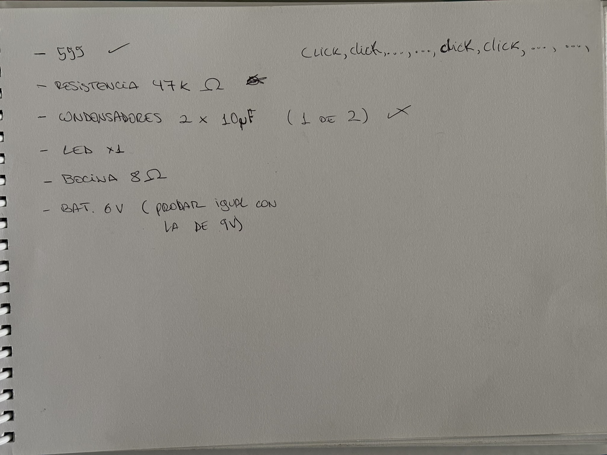
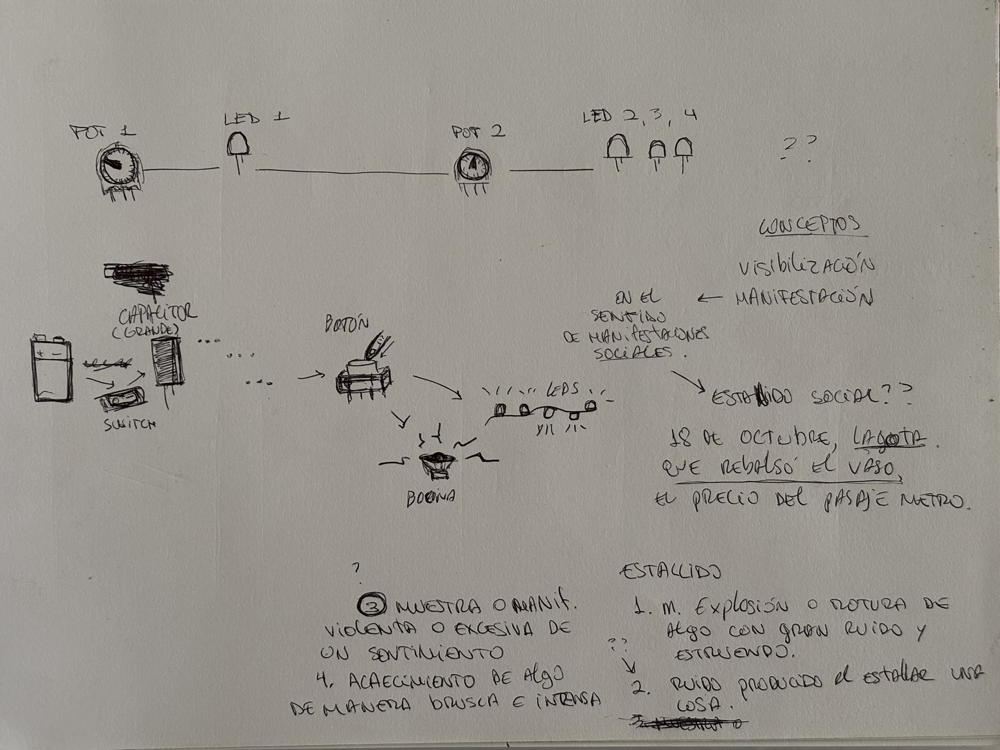
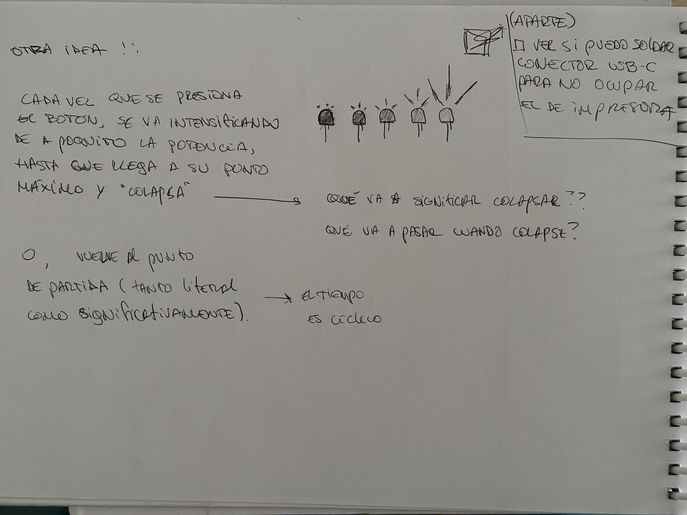
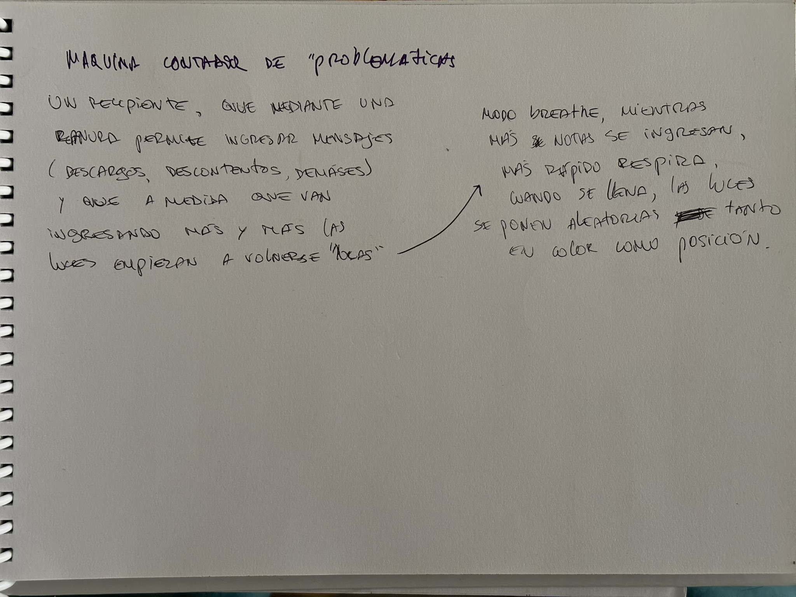

<!-- recordatorio: subir imágenes proceso -->

nuestra idea inicial fue un circuito que al encenderlo emitiera un sonido como un "click" pero de manera irregular, parecido al bombeo del corazón



---
nuestro prototipo se compone de un circuito integrado 555 junto a dos potenciómetros, donde uno de los potenciómetros regula la corriente que llega a la bocina y un diodo led, mientras que el otro potenciómetro, conectado al primer led y la bocina, regula la corriente que llega a los otros tres diodos leds, que únicamente encienden cuando el led y la bocina reciben corriente.



---
#### 22/08
nos surgió la idea de que al presionar una X cantidad de veces un botón, el brillo de los leds vaya aumentando cada vez que se presiona, partiendo de 0% a 100%.

el problema es que con un ic555 no podemos hacer un conteo de pulsaciones ni regular la corriente que llega al led con cada pulsación, necesitaríamos chips, transistores y resistencias que no tenemos.

lo que sí tenemos es un arduino, lo que nos hace la vida MUCHO más simple. únicamente hay que programarlo para que haga un conteo de las veces que se presiona el botón, y que vaya regulando la intensidad según donde vaya el contador (ej: para llegar al 100% de intensidad de los leds, se debe presionar el botón 10 veces. entonces si presiono el botón 3 veces, los leds se iluminan con un 30% de intensidad).

conceptualmente el prototipo va acerca de las manifestaciones (sociales), lo que me hizo mirar atrás a mi etapa de joven idealista con muchas buenas ideas, recordaba cuando en Octubre del 2019, entre medio de toda la tensión que circulaba por los aires de Santiago, alguien tuvo la valentía de anunciar que los valores del pasaje del metro subirían: la gota que rebalsaría el gran vaso de descontento social acumulado por décadas, acto que causó el bautizado 'estallido social' del 18 de Octubre.

---

conceptualmente, el prototipo va acerca de las manifestaciones sociales, lo que relacionamos con el aclamado estallido social del 18 de octubre, décadas de acumulación de descontentos, problemáticas que llegaron a su punto crítico (la gota que rebalsó el vaso) con la subida de los valores del pasaje del metro, desencadenando protestas descomunales, que lograron que gran cantidad del pueblo chileno se levantara a manifestar sus descontentos, liberando todo el descontento mezclado con impotencia de no poder hacer nada.

bajo la idea del estallido, pensé en la idea de hacer algo que (desde el momento en el que se conecta la batería, claro) va acumulando energía y acumulando y acumulando y acumulando hasta que aprete un botón, lo que causaría que libere toda esa energía de una, y encienda leds y una bocina, intentando representar, en este caso, un capacitor grande como ese "algo" que va acumulando y acumulando, cómo la gente (o la misma sociedad) se va guardando estos, sentimientos, molestias, descontentos hasta que llega a un punto crítico (la gota, la subida del pasaje del metro).
los 30 pesos del metro vendrían a ser en esta analogía el botón, porque después de presionarlo, se encienden los leds junto a la bocina **(darle una vuelta a la bocina respecto si dejarla o no)**.

otra idea surgida, gracias a ideas que Faustina me compartió respecto a la maqueta del prototipo, fue que el circuito fuera que en vez de que la energía se acumule automáticamente,
que se acumule de manera interactiva: 
cuando presionas una vez el botón, vas agregando un descontento a este "banco virtual" de descontentos, molestias, sentimientos problemáticas y demases. 
entonces, si vuelvo a presionar el botón, se agrega otra, y otra, y otra, hasta que llega a su punto de máxima capacidad y enciende al 100% los leds y (evaluarlo) la bocina.

aunque me complica el representar el estallido como tal, hacer explotar un capacitor chiquito? (top tier reference) hacer que se desmorone la maqueta? siento que hacer que encienda todo y ya queda muy meh, como que la historia no llegó a tener un desenlace.

entonces, el arduino tendrá un contador de las veces que se presiona el botón, y que cada vez que se presione el botón vaya de a poquito aumentando la intensidad de la luz y bocina, y que (por ahora, hasta que decifre qué va a ser el colapso final) cuando llegue al punto máximo (la décima pulsada), se reinicie el contador y vuelva a cero.

quizás dejarlo así pueda argumentarse con la idea de que la vida, el tiempo son cíclicos, que al final del día, todo vuelve a su punto de partida.

un gran poeta una vez dijo "la vida cambia, pero sigo tranquilo, que si esto es un ciclo volveremos al vinilo" Bak in de Deiz, Rick Santino - Rttc Comité, 2015.

una idea que rondaba en mi mente en esos tiempos de joven idealista con muchas buenas ideas, era de que cambios extremos eran necesarios en la historia de la humanidad, idea un poco extremista, alimentada de historias (como hora de aventura) donde todo pareciera ser más simple, sin las problemáticas que existen actualmente debido al negativo impacto que han tenido las nuevas tecnologías en la gente.



---

en el libro "Así habló Zaratustra", hay un capítulo llamado "De la visión y enigma", donde se postula la idea de que el tiempo es cíclico (la conversación con el enano sobre los dos caminos y la contradicción eterna entre ambos)

---
#### 24/08
nuevo. los profes me dieron otra mirada del prototipo, por lo que ahora será un recipiente que permite, a través de una ranura, ingresar notas. qué tipo de notas? desahogos, dolores, inquietudes, cuestionamientos, descontentos, todo lo relacionado a lo social, a lo político.



el recipiente tendrá también grietas en sus caras, excepto la frontal, la cual será transparente (para poder dejar ver su interior). estas grietas estarán iluminadas en su parte posterior y la iluminación tendrá un efecto de "respiración" (el brillo aumentará y disminuirá gradualmente).

la velocidad a la que respira la iluminación se verá determinada por la cantidad de notas que se ingresan al recipiente, la ranura por donde se ingresarán las notas tendrá un sensor óptico que permitirá hacer un conteo de la cantidad de notas ingresadas.

el circuito deberá también integrar un botón que permita resetear el contador, debido a que si limpio el recipiente, el procesador no tiene manera de saber si siguen o no las cartas ahí.

al momento en que el recipiente se "llene" (al momento que el contador llegue a una cantidad determinada de notas), la iluminación llegará a un punto donde el patrón de respiración se quebrará y se iluminará de manera aleatoria, como si la iluminaria estallase.

---

el circuito, estará compuesto de:
- arduino
- tira led WS2812B
- sensor óptico LM393
- botón
- fuente de poder (batería portátil usb)

código arduino:
```cpp
#include <Adafruit_NeoPixel.h>

#define PIN_LEDS      6
#define NUM_LEDS      12
#define PIN_SENSOR    2

Adafruit_NeoPixel strip(NUM_LEDS, PIN_LEDS, NEO_GRB + NEO_KHZ800);

const int CONTEO_MAX = 100;
volatile int contadorSensor = 0;
volatile bool nuevoDato = false;

volatile unsigned long ultimoDisparo = 0;
const unsigned long tiempoDebounce = 15;

float angulo = 0.0;
unsigned long ultimoTiempoRespiracion = 0;
unsigned long ultimoTiempoChispas = 0;

// tiempo efecto de chispas
unsigned long tiempoInicioChispas = 0;
bool chispasActivas = false;
const unsigned long DURACION_CHISPAS_FULL = 5000;   // 5 segundos a tope
const unsigned long DURACION_DESVANECER    = 10000;  // 10 segundos apagándose

void sensorISR() {
  unsigned long ahora = millis();
  if (ahora - ultimoDisparo > tiempoDebounce) {
    if (!chispasActivas) {
      contadorSensor++;
      nuevoDato = true;
    }
    ultimoDisparo = ahora;
  }
}

void setup() {
  Serial.begin(9600);
  pinMode(PIN_SENSOR, INPUT_PULLUP);
  attachInterrupt(digitalPinToInterrupt(PIN_SENSOR), sensorISR, FALLING);

  strip.begin();
  strip.show();

  Serial.println("=== Sistema Sensor Óptico LM393 Iniciado ===");
  Serial.println("Conteo actual: 0 / 100");
}

void loop() {
  unsigned long tiempoActual = millis();

  int conteoActual;
  noInterrupts();
  conteoActual = contadorSensor;
  bool huboDeteccion = nuevoDato;
  nuevoDato = false;
  interrupts();

  if (huboDeteccion && !chispasActivas) {
    Serial.print("Detecciones: ");
    Serial.print(conteoActual);
    Serial.print(" / ");
    Serial.print(CONTEO_MAX);
    if (conteoActual >= CONTEO_MAX) {
      Serial.println(" -> ¡100 ALCANZADO! Iniciando chispas...");
    } else {
      Serial.print(" -> Faltan ");
      Serial.println(CONTEO_MAX - conteoActual);
    }
  }

  if (conteoActual >= CONTEO_MAX && !chispasActivas) {
    chispasActivas = true;
    tiempoInicioChispas = tiempoActual;
  }

  if (!chispasActivas) {
    if (tiempoActual - ultimoTiempoRespiracion >= 15) {
      ultimoTiempoRespiracion = tiempoActual;

      float incremento = 0.01f + (conteoActual * 0.0024f);
      angulo += incremento;
      if (angulo >= 6.28318f) {
        angulo -= 6.28318f;
      }

      int brillo = (int)(((sin(angulo) + 1.0f) / 2.0f) * 255.0f);

      for (int i = 0; i < NUM_LEDS; i++) {
        strip.setPixelColor(i, strip.Color(brillo, 0, 0));
      }
      strip.show();
    }
  } 
  
  else {
    unsigned long tiempoTranscurrido = tiempoActual - tiempoInicioChispas;

    // --- Fin del ciclo total (5s + 10s) -> Reiniciar a 0 ---
    if (tiempoTranscurrido >= (DURACION_CHISPAS_FULL + DURACION_DESVANECER)) {
      chispasActivas = false;
      noInterrupts();
      contadorSensor = 0;
      interrupts();
      angulo = 0.0;
      strip.clear();
      strip.show();
      Serial.println("Secuencia terminada. Conteo reiniciado a 0.");
      return;
    }

    // --- Renderizado de Chispas ---
    static unsigned long intervaloChispas = 5;

    if (tiempoActual - ultimoTiempoChispas >= intervaloChispas) {
      ultimoTiempoChispas = tiempoActual;

      float factorIntensidad = 1.0; // 1.0 = máxima intensidad

      // Si pasaron los primeros 5s, calculamos la caída de intensidad durante los 10s siguientes
      if (tiempoTranscurrido > DURACION_CHISPAS_FULL) {
        unsigned long tiempoEnDecaimiento = tiempoTranscurrido - DURACION_CHISPAS_FULL;
        factorIntensidad = 1.0f - ((float)tiempoEnDecaimiento / (float)DURACION_DESVANECER);
        if (factorIntensidad < 0.0f) factorIntensidad = 0.0f;
      }

      // Desvanecimiento de estela
      for (int i = 0; i < NUM_LEDS; i++) {
        uint32_t colorActual = strip.getPixelColor(i);
        uint8_t r = (colorActual >> 16) & 0xFF;
        uint8_t g = (colorActual >> 8) & 0xFF;
        uint8_t b = colorActual & 0xFF;

        strip.setPixelColor(i, strip.Color(r * 0.45, g * 0.35, b * 0.2));
      }

      // La probabilidad de disparar chispas se reduce con el factor de intensidad
      if (random(0, 100) < (int)(factorIntensidad * 100)) {
        int numChispas = random(1, (int)(1 + 3 * factorIntensidad));
        for (int c = 0; c < numChispas; c++) {
          int pixelAleatorio = random(0, NUM_LEDS);
          
          uint8_t r = random(200, 256) * factorIntensidad;
          uint8_t g = random(20, 140) * factorIntensidad;
          uint8_t b = random(0, 15) * factorIntensidad;

          strip.setPixelColor(pixelAleatorio, strip.Color(r, g, b));
        }
      }

      strip.show();
      // El intervalo se vuelve ligeramente más lento a medida que se apagan
      int minMs = 2 + (int)((1.0f - factorIntensidad) * 10);
      int maxMs = 8 + (int)((1.0f - factorIntensidad) * 20);
      intervaloChispas = random(minMs, maxMs + 1);
    }
  }
}
```

el arduino debe ser capaz de leer el output del sensor óptico, cuando el output sea HIGH (módulo obstruido), sumar un contador +1.

por defecto las tiras led deben aumentar y disminuir su brillo gradualmente dando un efecto de respiración. el efecto de respiración tendrá una variable de aceleración.

el contador debe partir en 1, dado que el valor del contador será el multiplicador de la velocidad a la que "respira" la luz.

se debe definir un valor máximo basado en la cantidad de notas que se ingresarán al recipiente

cuando el contador alcance el valor máximo, la iluminación cambiará su patrón y se volverá aleatoria, tanto en qué leds se prenden y de qué color se prenden, a alta velocidad para dar la ilusión de estallido o explosión.

la explosión durará un tiempo determinado y después quedarán vestigios de la explosión, representados como luces intermitentes que apenas se logran mantener, como la iluminaria de una película futurista distópica.

el botón cumplirá la función de reiniciar el contador, debe posicionarse de manera discreta para que el usuario no lo presione por accidente.

---

conceptualmente el proyecto busca desmostrar de manera visual el punto de quiebre que puede haber, debido a la acumulación de dolores, descontentos, problemáticas que nunca se resuelven o que nunca se dejan ver, incitando a la reflexión en cuanto a cómo nos encontramos en estos tiempos, como personas, como sociedad, como nación.

----
REFERENTES

[Ballot Bin](https://ballotbin.co.uk/) (gracias Santi)\
[Shibboleth - Doris Salcedo](https://historia-arte.com/obras/shibboleth)\
[New Guide: Make a Glowing LED Resin River Table](https://blog.adafruit.com/2018/12/12/new-guide-make-a-glowing-led-resin-river-table/)\
[Alfredo Jaar, intervenciones urbanas](https://mac.uchile.cl/obras/intervenciones-urbanas-de-la-serie-estudios-sobre-la-felicidad/)

---

EL MEDIO ES EL MENSAJE (Comprender los medios de comunicación)

me llamó la atención la manera de ver la tecnología como una extensión del ser humano, porque, a pesar de ser una mirada con la que concuerdo, pareciera que muchas veces caemos en echarle la culpa a las mismas tecnologías: "sin las armas la sociedad sería mejor", "se me quedó pegado el computador" (perdiendo la partida de un videojuego). Aunque el ejemplo de las armas pueda verse un poco extremo, no deja de tener algo de verdad, acaso es responsable la bala o quien la manipula? acaso es responsable el computador (o el internet) de mi bajo rendimiento en los videojuegos? 
Aunque también es humano atribuirle la culpa a alguien (o algo) más, es parte de nuestra naturaleza aunque no queramos, y lo curioso es que lo hacemos de manera inconsciente. Incluso se puede ver en el discurso cotidiano: "*se me cayó* el lápiz", "*se me perdió* el perro en el parque". El otro día vi un fragmento de una entrevista donde se hablaba sobre el uso ético de las tecnologías y específicamente de las redes sociales, sobre hacer el bien o el mal, cosa algo debatible si pensamos en el ejemplo de la automatización que hace McLuhan al principio del capítulo, pero me devuelve a la misma pregunta sobre quién, o qué, es responsable de lo que ocurre en el mundo. Esta reflexión funciona, por lo menos con estas tecnologías "tradicionales" en las que uno tiene el control total de su funcionamiento, pero qué pasa con las nuevas tecnologías que cada vez incorporan más herramientas de inteligencia artificial, haciendo un guiño al caso del jóven que se suicidó a recomendación de su chatbot, porque claro, es evidente que la responsabilidad legal le corresponde a OpenAI, pero se podría argumentar, insensiblemente, que fue el mismo chatbot quien conversó con el adolescente, mas no la compañía que desarrolló el modelo, cuando sabemos (o deberíamos saber) que todo programa "autónomo" carece de autonomía real, dado que se rigen en base a la programación del mismo modelo, aunque no deja de ser algo que se escapa de nuestro control, como cuando una madre no logra hacer que su hijo pare de decir groserías. También podemos hablar de las consecuencias que han tenido las tecnologías en la salud mental hoy en día, es verdad que hoy existen problemas que hace 20 años atrás quizás no se habrían ni siquiera imaginado, como la ansiedad que nos genera el uso de las redes sociales. Por una parte, estamos sumergidos de información todos los días y de toda parte del mundo, por otro lado, el uso a una muy temprana edad, como se puede ver en el documental "El dilema de las redes sociales", con la angustia de la niña por no tener una cantidad suficiente de "me gusta" en sus publicaciones, que sí, las ansias de popularidad existían mucho antes de siquiera pensar en una máquina que pudiera ser capaz de sumar 2+2, pero nunca a una escala tan grande como lo es a día de hoy. Al ser parte de la generación que nació más o menos a la par con el nacimiento de las redes sociales, pude ver toda esa evolución siendo partícipe de estos nuevos medios, la gente ya no se juntaba a pelear afuera de las escuelas, sino que llegaban a la casa a grabarse con la webcam para insultarse y subirlo a "Ask.fm", nuestros modelos a seguir ya no eran cercanos o familiares que admirásemos, ahora son desconocidos, probablemente del otro extremo del mundo, que ciegamente creemos conocer, porque las redes sociales hoy no son un perfil de nuestra persona, sino un perfil de quien queremos hacer creer al resto que es nuestra persona, una gran máscara, en un universo virtual donde máscaras se relacionan con otras máscaras, perdiéndose la propia identidad, producto de esta evolución de la sociedad, porque no solo es ese el problema, también es el tema de que hoy en día nos comunicamos más en este entorno virtual que en la vida real, hay mayor conexión a internet que conexión con la otra persona. Hoy es raro que todos los vecinos se conozcan, a no ser que sean generaciones más adultas o quienes se conocían de hace años.
Décadas tuvieron que pasar para recién hoy darse cuenta de las consecuencias, en su mayoría negativas, que ha tenido el uso no supervisado de la internet a una temprana edad, ahora que llegamos a ese punto donde poco y nada sirve pedir perdón, pero ahora que sabemos que la tecnología es una extensión nuestra, podemos entender que ésta es inherentemente parte de la sociedad, por lo que tenemos el poder (y responsabilidad) de darle este enfoque más "humano" a la creación o implementación de nuevas tecnologías.


