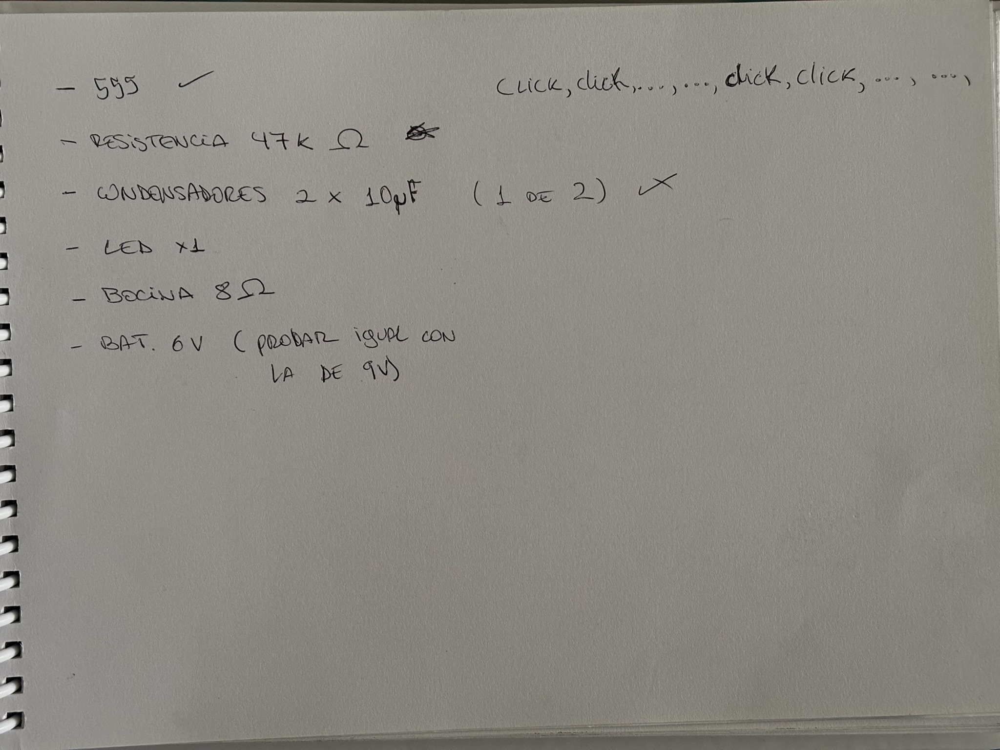
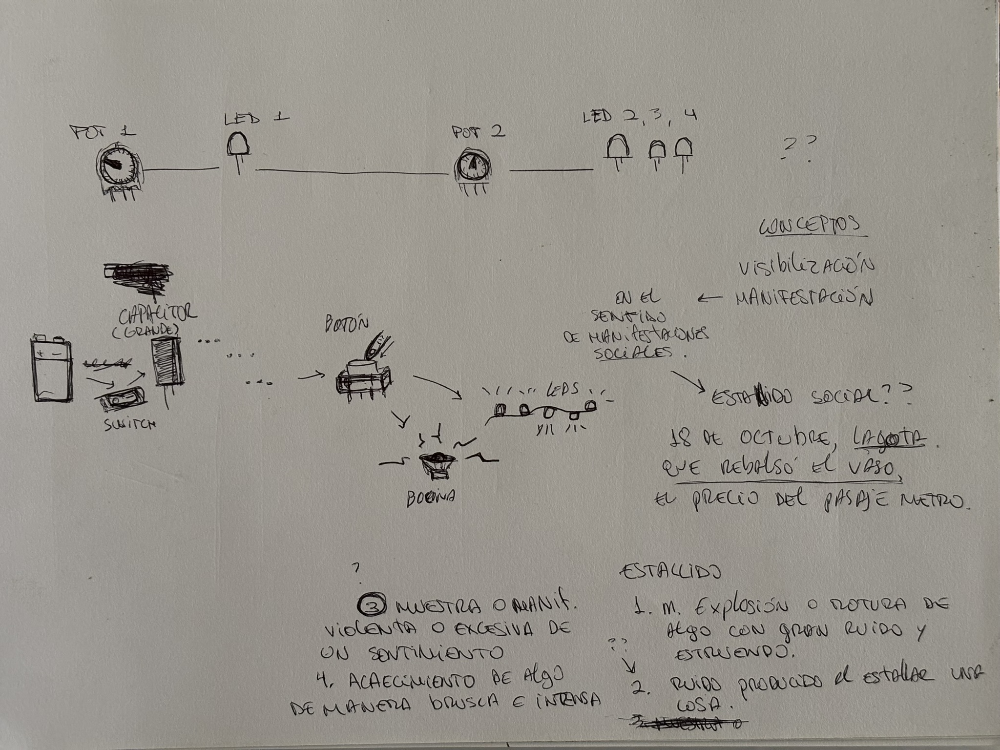
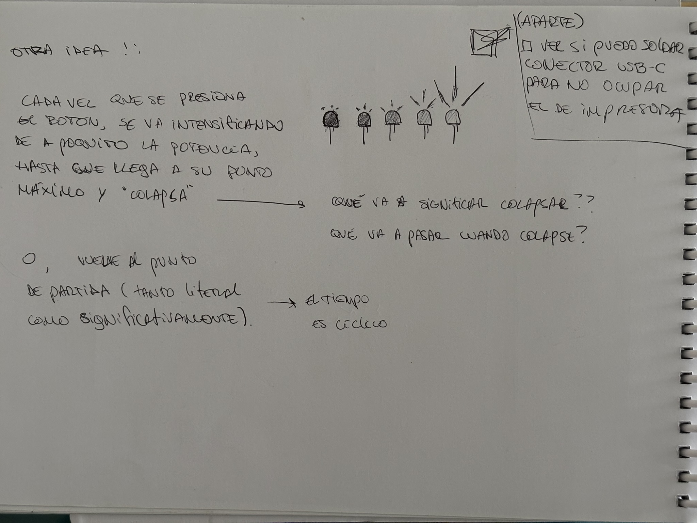
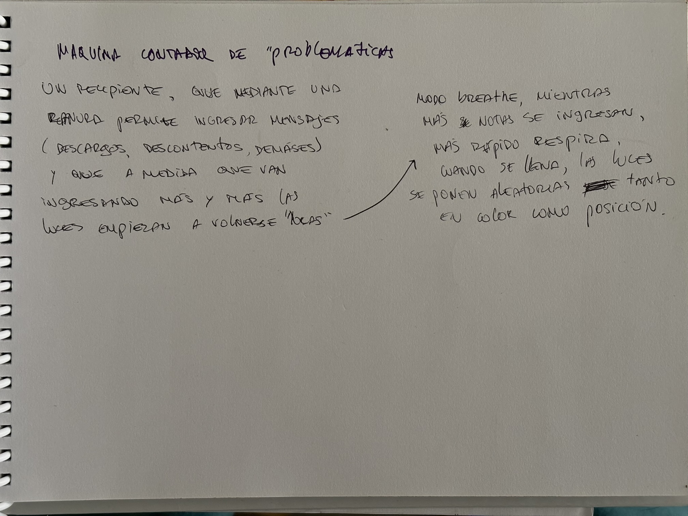
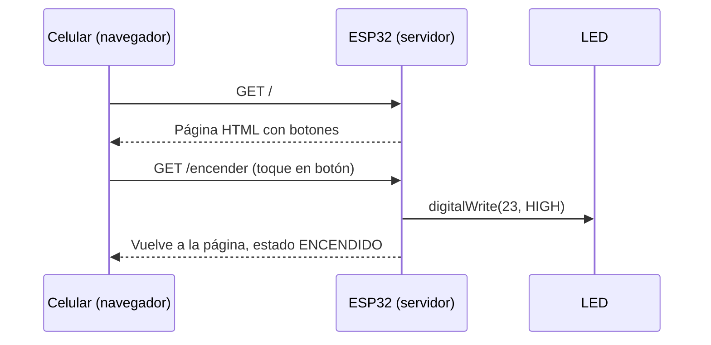

<!-- recordatorio: subir imágenes proceso -->

nuestra idea inicial fue un circuito que al encenderlo emitiera un sonido como un "click" pero de manera irregular, parecido al bombeo del corazón



---
nuestro prototipo se compone de un circuito integrado 555 junto a dos potenciómetros, donde uno de los potenciómetros regula la corriente que llega a la bocina y un diodo led, mientras que el otro potenciómetro, conectado al primer led y la bocina, regula la corriente que llega a los otros tres diodos leds, que únicamente encienden cuando el led y la bocina reciben corriente.



---
## 22 Agosto
nos surgió la idea de que al presionar una X cantidad de veces un botón, el brillo de los leds vaya aumentando cada vez que se presiona, partiendo de 0% a 100%.

el problema es que con un ic555 no podemos hacer un conteo de pulsaciones ni regular la corriente que llega al led con cada pulsación, necesitaríamos chips, transistores y resistencias que no tenemos.

lo que sí tenemos es un arduino, lo que nos hace la vida MUCHO más simple. únicamente hay que programarlo para que haga un conteo de las veces que se presiona el botón, y que vaya regulando la intensidad según donde vaya el contador (ej: para llegar al 100% de intensidad de los leds, se debe presionar el botón 10 veces. entonces si presiono el botón 3 veces, los leds se iluminan con un 30% de intensidad).

conceptualmente el prototipo va acerca de las manifestaciones (sociales), lo que me hizo mirar atrás a mi etapa de joven idealista con muchas buenas ideas, recordaba cuando en Octubre del 2019, entre medio de toda la tensión que circulaba por los aires de Santiago, alguien tuvo la valentía de anunciar que los valores del pasaje del metro subirían: la gota que rebalsaría el gran vaso de descontento social acumulado por décadas, acto que causó el bautizado 'estallido social' del 18 de Octubre.

---

conceptualmente, el prototipo va acerca de las manifestaciones sociales, lo que relacionamos con el aclamado estallido social del 18 de octubre, décadas de acumulación de descontentos, problemáticas que llegaron a su punto crítico (la gota que rebalsó el vaso) con la subida de los valores del pasaje del metro, desencadenando protestas descomunales, que lograron que gran cantidad del pueblo chileno se levantara a manifestar sus descontentos, liberando todo el descontento mezclado con impotencia de no poder hacer nada.

bajo la idea del estallido, pensé en la idea de hacer algo que (desde el momento en el que se conecta la batería, claro) va acumulando energía y acumulando y acumulando y acumulando hasta que aprete un botón, lo que causaría que libere toda esa energía de una, y encienda leds y una bocina, intentando representar, en este caso, un capacitor grande como ese "algo" que va acumulando y acumulando, cómo la gente (o la misma sociedad) se va guardando estos, sentimientos, molestias, descontentos hasta que llega a un punto crítico (la gota, la subida del pasaje del metro).
los 30 pesos del metro vendrían a ser en esta analogía el botón, porque después de presionarlo, se encienden los leds junto a la bocina **(darle una vuelta a la bocina respecto si dejarla o no)**.

otra idea surgida, gracias a ideas que Faustina me compartió respecto a la maqueta del prototipo, fue que el circuito fuera que en vez de que la energía se acumule automáticamente,
que se acumule de manera interactiva: 
cuando presionas una vez el botón, vas agregando un descontento a este "banco virtual" de descontentos, molestias, sentimientos problemáticas y demases. 
entonces, si vuelvo a presionar el botón, se agrega otra, y otra, y otra, hasta que llega a su punto de máxima capacidad y enciende al 100% los leds y (evaluarlo) la bocina.

aunque me complica el representar el estallido como tal, hacer explotar un capacitor chiquito? (top tier reference) hacer que se desmorone la maqueta? siento que hacer que encienda todo y ya queda muy meh, como que la historia no llegó a tener un desenlace.

entonces, el arduino tendrá un contador de las veces que se presiona el botón, y que cada vez que se presione el botón vaya de a poquito aumentando la intensidad de la luz y bocina, y que (por ahora, hasta que decifre qué va a ser el colapso final) cuando llegue al punto máximo (la décima pulsada), se reinicie el contador y vuelva a cero.

quizás dejarlo así pueda argumentarse con la idea de que la vida, el tiempo son cíclicos, que al final del día, todo vuelve a su punto de partida.

un gran poeta una vez dijo "la vida cambia, pero sigo tranquilo, que si esto es un ciclo volveremos al vinilo" Bak in de Deiz, Rick Santino - Rttc Comité, 2015.

una idea que rondaba en mi mente en esos tiempos de joven idealista con muchas buenas ideas, era de que cambios extremos eran necesarios en la historia de la humanidad, idea un poco extremista, alimentada de historias (como hora de aventura) donde todo pareciera ser más simple, sin las problemáticas que existen actualmente debido al negativo impacto que han tenido las nuevas tecnologías en la gente.



---

en el libro "Así habló Zaratustra", hay un capítulo llamado "De la visión y enigma", donde se postula la idea de que el tiempo es cíclico (la conversación con el enano sobre los dos caminos y la contradicción eterna entre ambos)

---
## 24 Agosto
nuevo. los profes me dieron otra mirada del prototipo, por lo que ahora será un recipiente que permite, a través de una ranura, ingresar notas. qué tipo de notas? desahogos, dolores, inquietudes, cuestionamientos, descontentos, todo lo relacionado a lo social, a lo político.



el recipiente tendrá también grietas en sus caras, excepto la frontal, la cual será transparente (para poder dejar ver su interior). estas grietas estarán iluminadas en su parte posterior y la iluminación tendrá un efecto de "respiración" (el brillo aumentará y disminuirá gradualmente).

la velocidad a la que respira la iluminación se verá determinada por la cantidad de notas que se ingresan al recipiente, la ranura por donde se ingresarán las notas tendrá un sensor óptico que permitirá hacer un conteo de la cantidad de notas ingresadas.

el circuito deberá también integrar un botón que permita resetear el contador, debido a que si limpio el recipiente, el procesador no tiene manera de saber si siguen o no las cartas ahí.

al momento en que el recipiente se "llene" (al momento que el contador llegue a una cantidad determinada de notas), la iluminación llegará a un punto donde el patrón de respiración se quebrará y se iluminará de manera aleatoria, como si la iluminaria estallase.

---

el circuito, estará compuesto de:
- arduino
- tira led WS2812B
- sensor óptico LM393
- botón
- fuente de poder (batería portátil usb)

código arduino:
```cpp
#include <Adafruit_NeoPixel.h>

#define PIN_LEDS      6
#define NUM_LEDS      12
#define PIN_SENSOR    2

Adafruit_NeoPixel strip(NUM_LEDS, PIN_LEDS, NEO_GRB + NEO_KHZ800);

const int CONTEO_MAX = 100;
volatile int contadorSensor = 0;
volatile bool nuevoDato = false;

volatile unsigned long ultimoDisparo = 0;
const unsigned long tiempoDebounce = 15;

float angulo = 0.0;
unsigned long ultimoTiempoRespiracion = 0;
unsigned long ultimoTiempoChispas = 0;

// tiempo efecto de chispas
unsigned long tiempoInicioChispas = 0;
bool chispasActivas = false;
const unsigned long DURACION_CHISPAS_FULL = 5000;   // 5 segundos a tope
const unsigned long DURACION_DESVANECER    = 10000;  // 10 segundos apagándose

void sensorISR() {
  unsigned long ahora = millis();
  if (ahora - ultimoDisparo > tiempoDebounce) {
    if (!chispasActivas) {
      contadorSensor++;
      nuevoDato = true;
    }
    ultimoDisparo = ahora;
  }
}

void setup() {
  Serial.begin(9600);
  pinMode(PIN_SENSOR, INPUT_PULLUP);
  attachInterrupt(digitalPinToInterrupt(PIN_SENSOR), sensorISR, FALLING);

  strip.begin();
  strip.show();

  Serial.println("=== Sistema Sensor Óptico LM393 Iniciado ===");
  Serial.println("Conteo actual: 0 / 100");
}

void loop() {
  unsigned long tiempoActual = millis();

  int conteoActual;
  noInterrupts();
  conteoActual = contadorSensor;
  bool huboDeteccion = nuevoDato;
  nuevoDato = false;
  interrupts();

  if (huboDeteccion && !chispasActivas) {
    Serial.print("Detecciones: ");
    Serial.print(conteoActual);
    Serial.print(" / ");
    Serial.print(CONTEO_MAX);
    if (conteoActual >= CONTEO_MAX) {
      Serial.println(" -> ¡100 ALCANZADO! Iniciando chispas...");
    } else {
      Serial.print(" -> Faltan ");
      Serial.println(CONTEO_MAX - conteoActual);
    }
  }

  if (conteoActual >= CONTEO_MAX && !chispasActivas) {
    chispasActivas = true;
    tiempoInicioChispas = tiempoActual;
  }

  if (!chispasActivas) {
    if (tiempoActual - ultimoTiempoRespiracion >= 15) {
      ultimoTiempoRespiracion = tiempoActual;

      float incremento = 0.01f + (conteoActual * 0.0024f);
      angulo += incremento;
      if (angulo >= 6.28318f) {
        angulo -= 6.28318f;
      }

      int brillo = (int)(((sin(angulo) + 1.0f) / 2.0f) * 255.0f);

      for (int i = 0; i < NUM_LEDS; i++) {
        strip.setPixelColor(i, strip.Color(brillo, 0, 0));
      }
      strip.show();
    }
  } 
  
  else {
    unsigned long tiempoTranscurrido = tiempoActual - tiempoInicioChispas;

    // --- Fin del ciclo total (5s + 10s) -> Reiniciar a 0 ---
    if (tiempoTranscurrido >= (DURACION_CHISPAS_FULL + DURACION_DESVANECER)) {
      chispasActivas = false;
      noInterrupts();
      contadorSensor = 0;
      interrupts();
      angulo = 0.0;
      strip.clear();
      strip.show();
      Serial.println("Secuencia terminada. Conteo reiniciado a 0.");
      return;
    }

    // --- Renderizado de Chispas ---
    static unsigned long intervaloChispas = 5;

    if (tiempoActual - ultimoTiempoChispas >= intervaloChispas) {
      ultimoTiempoChispas = tiempoActual;

      float factorIntensidad = 1.0; // 1.0 = máxima intensidad

      // Si pasaron los primeros 5s, calculamos la caída de intensidad durante los 10s siguientes
      if (tiempoTranscurrido > DURACION_CHISPAS_FULL) {
        unsigned long tiempoEnDecaimiento = tiempoTranscurrido - DURACION_CHISPAS_FULL;
        factorIntensidad = 1.0f - ((float)tiempoEnDecaimiento / (float)DURACION_DESVANECER);
        if (factorIntensidad < 0.0f) factorIntensidad = 0.0f;
      }

      // Desvanecimiento de estela
      for (int i = 0; i < NUM_LEDS; i++) {
        uint32_t colorActual = strip.getPixelColor(i);
        uint8_t r = (colorActual >> 16) & 0xFF;
        uint8_t g = (colorActual >> 8) & 0xFF;
        uint8_t b = colorActual & 0xFF;

        strip.setPixelColor(i, strip.Color(r * 0.45, g * 0.35, b * 0.2));
      }

      // La probabilidad de disparar chispas se reduce con el factor de intensidad
      if (random(0, 100) < (int)(factorIntensidad * 100)) {
        int numChispas = random(1, (int)(1 + 3 * factorIntensidad));
        for (int c = 0; c < numChispas; c++) {
          int pixelAleatorio = random(0, NUM_LEDS);
          
          uint8_t r = random(200, 256) * factorIntensidad;
          uint8_t g = random(20, 140) * factorIntensidad;
          uint8_t b = random(0, 15) * factorIntensidad;

          strip.setPixelColor(pixelAleatorio, strip.Color(r, g, b));
        }
      }

      strip.show();
      // El intervalo se vuelve ligeramente más lento a medida que se apagan
      int minMs = 2 + (int)((1.0f - factorIntensidad) * 10);
      int maxMs = 8 + (int)((1.0f - factorIntensidad) * 20);
      intervaloChispas = random(minMs, maxMs + 1);
    }
  }
}
```

el arduino debe ser capaz de leer el output del sensor óptico, cuando el output sea HIGH (módulo obstruido), sumar un contador +1.

por defecto las tiras led deben aumentar y disminuir su brillo gradualmente dando un efecto de respiración. el efecto de respiración tendrá una variable de aceleración.

el contador debe partir en 1, dado que el valor del contador será el multiplicador de la velocidad a la que "respira" la luz.

se debe definir un valor máximo basado en la cantidad de notas que se ingresarán al recipiente

cuando el contador alcance el valor máximo, la iluminación cambiará su patrón y se volverá aleatoria, tanto en qué leds se prenden y de qué color se prenden, a alta velocidad para dar la ilusión de estallido o explosión.

la explosión durará un tiempo determinado y después quedarán vestigios de la explosión, representados como luces intermitentes que apenas se logran mantener, como la iluminaria de una película futurista distópica.

el botón cumplirá la función de reiniciar el contador, debe posicionarse de manera discreta para que el usuario no lo presione por accidente.

---

conceptualmente el proyecto busca desmostrar de manera visual el punto de quiebre que puede haber, debido a la acumulación de dolores, descontentos, problemáticas que nunca se resuelven o que nunca se dejan ver, incitando a la reflexión en cuanto a cómo nos encontramos en estos tiempos, como personas, como sociedad, como nación.

----
REFERENTES

[Ballot Bin](https://ballotbin.co.uk/) (gracias Santi)\
[Shibboleth - Doris Salcedo](https://historia-arte.com/obras/shibboleth)\
[New Guide: Make a Glowing LED Resin River Table](https://blog.adafruit.com/2018/12/12/new-guide-make-a-glowing-led-resin-river-table/)\
[Alfredo Jaar, intervenciones urbanas](https://mac.uchile.cl/obras/intervenciones-urbanas-de-la-serie-estudios-sobre-la-felicidad/)

---

## EL MEDIO ES EL MENSAJE (Comprender los medios de comunicación)

me llamó la atención la manera de ver la tecnología como una extensión del ser humano, porque, a pesar de ser una mirada con la que concuerdo, pareciera que muchas veces caemos en echarle la culpa a las mismas tecnologías: "sin las armas la sociedad sería mejor", "se me quedó pegado el computador" (perdiendo la partida de un videojuego). Aunque el ejemplo de las armas pueda verse un poco extremo, no deja de tener algo de verdad, acaso es responsable la bala o quien la manipula? acaso es responsable el computador (o el internet) de mi bajo rendimiento en los videojuegos? 
Aunque también es humano atribuirle la culpa a alguien (o algo) más, es parte de nuestra naturaleza aunque no queramos, y lo curioso es que lo hacemos de manera inconsciente. Incluso se puede ver en el discurso cotidiano: "*se me cayó* el lápiz", "*se me perdió* el perro en el parque". El otro día vi un fragmento de una entrevista donde se hablaba sobre el uso ético de las tecnologías y específicamente de las redes sociales, sobre hacer el bien o el mal, cosa algo debatible si pensamos en el ejemplo de la automatización que hace McLuhan al principio del capítulo, pero me devuelve a la misma pregunta sobre quién, o qué, es responsable de lo que ocurre en el mundo. Esta reflexión funciona, por lo menos con estas tecnologías "tradicionales" en las que uno tiene el control total de su funcionamiento, pero qué pasa con las nuevas tecnologías que cada vez incorporan más herramientas de inteligencia artificial, haciendo un guiño al caso del jóven que se suicidó a recomendación de su chatbot, porque claro, es evidente que la responsabilidad legal le corresponde a OpenAI, pero se podría argumentar, insensiblemente, que fue el mismo chatbot quien conversó con el adolescente, mas no la compañía que desarrolló el modelo, cuando sabemos (o deberíamos saber) que todo programa "autónomo" carece de autonomía real, dado que se rigen en base a la programación del mismo modelo, aunque no deja de ser algo que se escapa de nuestro control, como cuando una madre no logra hacer que su hijo pare de decir groserías. También podemos hablar de las consecuencias que han tenido las tecnologías en la salud mental hoy en día, es verdad que hoy existen problemas que hace 20 años atrás quizás no se habrían ni siquiera imaginado, como la ansiedad que nos genera el uso de las redes sociales. Por una parte, estamos sumergidos de información todos los días y de toda parte del mundo, por otro lado, el uso a una muy temprana edad, como se puede ver en el documental "El dilema de las redes sociales", con la angustia de la niña por no tener una cantidad suficiente de "me gusta" en sus publicaciones, que sí, las ansias de popularidad existían mucho antes de siquiera pensar en una máquina que pudiera ser capaz de sumar 2+2, pero nunca a una escala tan grande como lo es a día de hoy. Al ser parte de la generación que nació más o menos a la par con el nacimiento de las redes sociales, pude ver toda esa evolución siendo partícipe de estos nuevos medios, la gente ya no se juntaba a pelear afuera de las escuelas, sino que llegaban a la casa a grabarse con la webcam para insultarse y subirlo a "Ask.fm", nuestros modelos a seguir ya no eran cercanos o familiares que admirásemos, ahora son desconocidos, probablemente del otro extremo del mundo, que ciegamente creemos conocer, porque las redes sociales hoy no son un perfil de nuestra persona, sino un perfil de quien queremos hacer creer al resto que es nuestra persona, una gran máscara, en un universo virtual donde máscaras se relacionan con otras máscaras, perdiéndose la propia identidad, producto de esta evolución de la sociedad, porque no solo es ese el problema, también es el tema de que hoy en día nos comunicamos más en este entorno virtual que en la vida real, hay mayor conexión a internet que conexión con la otra persona. Hoy es raro que todos los vecinos se conozcan, a no ser que sean generaciones más adultas o quienes se conocían de hace años.
Décadas tuvieron que pasar para recién hoy darse cuenta de las consecuencias, en su mayoría negativas, que ha tenido el uso no supervisado de la internet a una temprana edad, ahora que llegamos a ese punto donde poco y nada sirve pedir perdón, pero ahora que sabemos que la tecnología es una extensión nuestra, podemos entender que ésta es inherentemente parte de la sociedad, por lo que tenemos el poder (y responsabilidad) de darle este enfoque más "humano" a la creación o implementación de nuevas tecnologías.

## 12 Septiembre
### DUELO (o nostalgia?)

~~trabajamos con el concepto de la muerte y el duelo asociado a la pérdida de un ser querido, buscando demostrar que el duelo no es evadible, es necesario y parte de nuestro desarrollo como seres humanos.~~

el proyecto principalmente trabaja con la nostalgia, al mostrar un video que refleja momentos del pasado y que insta a recordar que tiempos pasados siempre fueron mejores. 
al intentar acercarse a este pasado, el video se empieza a desvanecer, reflejando que uno no puede volver al pasado, por más que lo intente, y que la única manera de seguir adelante es soltando el pasado y aprender a vivir en el presente

la nostalgia nos atrae como un imán hacia un pasado idealizado, pero el pasado es un lugar inalcanzable. Cuando intentamos acercarnos para "tocar" ese recuerdo, la memoria revela su fragilidad: se distorsiona y finalmente se desvanece. La instalación materializa exactamente cómo funciona nuestra mente al intentar habitar un recuerdo. Vivimos en una época de constante "retromanía" (consumo de nostalgia), donde buscamos refugio en estéticas del pasado. MediaPipe actúa como el "ojo" del sistema, leyendo el cuerpo del usuario y calculando su distancia en tiempo real. Los datos de proximidad se envían para alterar los parámetros del video (escala de distorsión y opacidad). Para el usuario una persona inmersa en la conexión actual que buscan experiencias contemplativas. El usuario pasa de ser un espectador pasivo a un "destructor" involuntario de la obra la instalación lo obliga a aceptar que la única forma de preservar intacta la imagen (el pasado) es manteniendo distancia.

---
### qué
el proyecto principalmente trabaja con la nostalgia, al mostrar un video que refleja momentos del pasado y que insta a recordar que tiempos pasados siempre fueron mejores.

Cuando intentamos acercarnos para "tocar" ese recuerdo, la memoria revela su fragilidad: se distorsiona y finalmente se desvanece. La instalación materializa exactamente cómo funciona nuestra mente al intentar habitar un recuerdo.

---
### por qué
la nostalgia nos atrae como un imán hacia un pasado idealizado, pero el pasado es un lugar inalcanzable. Cuando intentamos acercarnos para "tocar" ese recuerdo, la memoria revela su fragilidad: se distorsiona y finalmente se desvanece. Vivimos en una época de una constante "retromanía", donde buscamos refugio en estéticas del pasado.

---
### cómo
La instalación materializa exactamente cómo funciona nuestra mente al intentar habitar un recuerdo.

MediaPipe actúa como el "ojo" del sistema, leyendo el cuerpo del usuario y calculando su distancia en tiempo real. Los datos de proximidad se envían para alterar los parámetros del video (escala de distorsión y opacidad).

El usuario pasa de ser un espectador pasivo a un "destructor" involuntario de la obra la instalación lo obliga a aceptar que la única forma de preservar intacta la imagen (el pasado) es manteniendo distancia.

---
### para quién
El usuario objetivo es una persona inmersa en el pasado y que carga con una gran melancolía

---

[DECLARAR UN CONCEPTO APLICADO QUE LOGRE HILAR TODOS LOS PUNTOS] (nostalgia?)

---

una tele con las luces detrás
la tele mostrará un video (nostálgico)
una cámara detectará una cara y al momento en que la cara se empieza a acercar, el video se irá desvaneciendo
las luces acompañarán a la visual desvaneciendose 

---

## encargo 10+1

### ejercicio1: blink
encender y apagar led cada 1 segundo

esp32: 
pin 23 de la esp32--> resistencia 220 --> ánodo (+) led -.-.-.- cátodo (-) led -->gnd de la esp32

código base:
```cpp
const int PIN_LED=23; // pin del led
const int TIEMPO = 1000; // 1000 ms,

void setup(){
    pinMode(PIN_LED, OUTPUT); // pin 23 actuará como salida
}

void loop(){
    digitalWrite(PIN_LED, HIGH); // 3.3V en led, encendido
    delay(TIEMPO); //esperar 1 segundo (TIEMPO=1000)
    digitalWrite(PIN_LED, LOW); // 0V en led, apagao
    delay(TIEMPO); //esperar 1 segundo
}
```

##### desafío uno (1): que el led parpadee el doble de rápido
``` cpp
const int PIN_LED=23; // pin del led
const int TIEMPO = 500; // 500ms = .5 segundos (medio segundo) (la mitad de un segundo)

void setup(){
    pinMode(PIN_LED, OUTPUT); // pin 23 actuará como salida
}

void loop(){
    digitalWrite(PIN_LED, HIGH); // 3.3V en led, encendido
    delay(TIEMPO); //esperar 1 segundo (TIEMPO=1000)
    digitalWrite(PIN_LED, LOW); // 0V en led, apagao
    delay(TIEMPO); //esperar 1 segundo
}

```

##### desafío 2 (dos): encendido por 200ms y apagado por 800ms
```cpp
const int PIN_LED=23; // pin del led
const int dos=200;
const int osho=800;

void setup(){
    pinMode(PIN_LED, OUTPUT); // pin 23 actuará como salida
}

void loop(){
    digitalWrite(PIN_LED, HIGH); // 3.3V en led, encendido
    delay(dos); //esperar 200ms
    digitalWrite(PIN_LED, LOW); // 0V en led, apagao
    delay(osho); //esperar 800ms
}
```

##### desafío 3: SOS en morse ( ...---... )
```cpp
// v1, no se nota el cambio entre la primera S y la O

// punto: una unidad de tiempo
// raya: 3 unidades de tiempo
// espacio entre puntos y rayas: una unidad de tiempo
// unidad de tiempo: 100ms

const int PIN_LED=23; // pin del led
const int unidad=100;

void setup(){
    pinMode(PIN_LED, OUTPUT); // pin 23 actuará como salida
}

void loop(){
    // S (...)
    digitalWrite(PIN_LED, HIGH); // 3.3V en led, encendido
    delay(unidad);
    digitalWrite(PIN_LED, LOW); // 0V en led, apagao
    delay(unidad);
    
    digitalWrite(PIN_LED, HIGH); // 3.3V en led, encendido
    delay(unidad);
    digitalWrite(PIN_LED, LOW); // 0V en led, apagao
    delay(unidad);
    
    digitalWrite(PIN_LED, HIGH); // 3.3V en led, encendido
    delay(unidad);
    digitalWrite(PIN_LED, LOW); // 0V en led, apagao
    delay(unidad);

    // O (---)
    digitalWrite(PIN_LED, HIGH); // 3.3V en led, encendido
    delay(unidad*3);
    digitalWrite(PIN_LED, LOW); // 0V en led, apagao
    delay(unidad*3);

    digitalWrite(PIN_LED, HIGH); // 3.3V en led, encendido
    delay(unidad*3);
    digitalWrite(PIN_LED, LOW); // 0V en led, apagao
    delay(unidad*3);
    
    digitalWrite(PIN_LED, HIGH); // 3.3V en led, encendido
    delay(unidad*3);
    digitalWrite(PIN_LED, LOW); // 0V en led, apagao
    delay(unidad*3);
    
    // S (...)
    digitalWrite(PIN_LED, HIGH); // 3.3V en led, encendido
    delay(unidad);
    digitalWrite(PIN_LED, LOW); // 0V en led, apagao
    delay(unidad);
    
    digitalWrite(PIN_LED, HIGH); // 3.3V en led, encendido
    delay(unidad);
    digitalWrite(PIN_LED, LOW); // 0V en led, apagao
    delay(unidad);
    
    digitalWrite(PIN_LED, HIGH); // 3.3V en led, encendido
    delay(unidad);
    digitalWrite(PIN_LED, LOW); // 0V en led, apagao
    delay(unidad*7); // demora más para que no parezca SOSOSOSOSOSOSOSOSOS
}
```

```cpp
// v2, muy rápido quizás

// punto: una unidad de tiempo
// raya: 3 unidades de tiempo
// espacio entre puntos y rayas: una unidad de tiempo
// unidad de tiempo: 100ms

const int PIN_LED=23; // pin del led
const int unidad=100;

void setup(){
    pinMode(PIN_LED, OUTPUT); // pin 23 actuará como salida
}

void loop(){
    // S (...)
    digitalWrite(PIN_LED, HIGH); // 3.3V en led, encendido
    delay(unidad);
    digitalWrite(PIN_LED, LOW); // 0V en led, apagao
    delay(unidad);
    
    digitalWrite(PIN_LED, HIGH); // 3.3V en led, encendido
    delay(unidad);
    digitalWrite(PIN_LED, LOW); // 0V en led, apagao
    delay(unidad);
    
    digitalWrite(PIN_LED, HIGH); // 3.3V en led, encendido
    delay(unidad);
    digitalWrite(PIN_LED, LOW); // 0V en led, apagao
    delay(unidad*3);

    // O (---)
    digitalWrite(PIN_LED, HIGH); // 3.3V en led, encendido
    delay(unidad*3);
    digitalWrite(PIN_LED, LOW); // 0V en led, apagao
    delay(unidad*3);

    digitalWrite(PIN_LED, HIGH); // 3.3V en led, encendido
    delay(unidad*3);
    digitalWrite(PIN_LED, LOW); // 0V en led, apagao
    delay(unidad*3);
    
    digitalWrite(PIN_LED, HIGH); // 3.3V en led, encendido
    delay(unidad*3);
    digitalWrite(PIN_LED, LOW); // 0V en led, apagao
    delay(unidad*3);
    
    // S (...)
    digitalWrite(PIN_LED, HIGH); // 3.3V en led, encendido
    delay(unidad);
    digitalWrite(PIN_LED, LOW); // 0V en led, apagao
    delay(unidad);
    
    digitalWrite(PIN_LED, HIGH); // 3.3V en led, encendido
    delay(unidad);
    digitalWrite(PIN_LED, LOW); // 0V en led, apagao
    delay(unidad);
    
    digitalWrite(PIN_LED, HIGH); // 3.3V en led, encendido
    delay(unidad);
    digitalWrite(PIN_LED, LOW); // 0V en led, apagao
    delay(unidad*7); // demora más para que no parezca SOSOSOSOSOSOSOSOSOS
}
```

```cpp
//v3, cambié velocidad (valor unidad) y la demora de apagado en la O

// punto: una unidad de tiempo
// raya: 3 unidades de tiempo
// espacio entre puntos y rayas: una unidad de tiempo
// espacio entre letras: 3 unidades
// unidad de tiempo: 100ms

const int PIN_LED=23; // pin del led
const int unidad=200;

void setup(){
    pinMode(PIN_LED, OUTPUT); // pin 23 actuará como salida
}

void loop(){
    // S (...)
    digitalWrite(PIN_LED, HIGH); // 3.3V en led, encendido
    delay(unidad);
    digitalWrite(PIN_LED, LOW); // 0V en led, apagao
    delay(unidad);
    
    digitalWrite(PIN_LED, HIGH); // 3.3V en led, encendido
    delay(unidad);
    digitalWrite(PIN_LED, LOW); // 0V en led, apagao
    delay(unidad);
    
    digitalWrite(PIN_LED, HIGH); // 3.3V en led, encendido
    delay(unidad);
    digitalWrite(PIN_LED, LOW); // 0V en led, apagao
    delay(unidad*3);

    // O (---)
    digitalWrite(PIN_LED, HIGH); // 3.3V en led, encendido
    delay(unidad*3);
    digitalWrite(PIN_LED, LOW); // 0V en led, apagao
    delay(unidad);

    digitalWrite(PIN_LED, HIGH); // 3.3V en led, encendido
    delay(unidad*3);
    digitalWrite(PIN_LED, LOW); // 0V en led, apagao
    delay(unidad);
    
    digitalWrite(PIN_LED, HIGH); // 3.3V en led, encendido
    delay(unidad*3);
    digitalWrite(PIN_LED, LOW); // 0V en led, apagao
    delay(unidad*3);
    
    // S (...)
    digitalWrite(PIN_LED, HIGH); // 3.3V en led, encendido
    delay(unidad);
    digitalWrite(PIN_LED, LOW); // 0V en led, apagao
    delay(unidad);
    
    digitalWrite(PIN_LED, HIGH); // 3.3V en led, encendido
    delay(unidad);
    digitalWrite(PIN_LED, LOW); // 0V en led, apagao
    delay(unidad);
    
    digitalWrite(PIN_LED, HIGH); // 3.3V en led, encendido
    delay(unidad);
    digitalWrite(PIN_LED, LOW); // 0V en led, apagao
    delay(unidad*7); // demora más para que no parezca SOSOSOSOSOSOSOSOSOS
}
```
### ejercicio 2, led con pulsador
##### led enciende solo mientras se presiona el botón

mantener circuito anterior, pero agregar botón en pin 4

incluir `INPUT_PULLUP` para evitar valores falsos por ruido eléctrico del ambiente, fuerza el pin a devolver `HIGH` por defecto

código base:
``` cpp
const int PIN_LED=23; // salida: LED
const int PIN_BOTON=4; // entrada: pulsador (botón)

void setup(){
  pinMode(PIN_LED, OUTPUT); // explicita que PIN_LED es un pin de salida
  pinMode(PIN_BOTON, INPUT_PULLUP); // botón es valor de entrada con pullup
  Serial.begin(115200); // activa monitor serial
}

void loop(){
  // 1. leer
  int estadoBoton=digitalRead(PIN_BOTON);

  // 2. condicionales
  if (estadoBoton==LOW){
    digitalWrite(PIN_LED, HIGH);
    Serial.println("botón presionado: LED encendido");
  } else{
    digitalWrite(PIN_LED, LOW);
  }

  delay(10); // pausa para no saturar monitor
}

```

##### desafío 1
invertir comportamiento (LED encendido siempre, apagar al presionar)
```cpp
const int PIN_LED=23; // salida: LED
const int PIN_BOTON=4; // entrada: pulsador (botón)

void setup(){
  pinMode(PIN_LED, OUTPUT); // explicita que PIN_LED es un pin de salida
  pinMode(PIN_BOTON, INPUT_PULLUP); // botón es valor de entrada con pullup
  Serial.begin(115200); // activa monitor serial
}

void loop(){
  // 1. leer
  int estadoBoton=digitalRead(PIN_BOTON);

  // 2. condicionales
  if (estadoBoton==LOW){
    digitalWrite(PIN_LED, LOW);
    Serial.println("botón presionado: LED apaga2");
  } else{
    digitalWrite(PIN_LED, HIGH);
  }

  delay(10); // pausa para no saturar monitor
}

```

##### desafío 2
que el LED parpadee mientras el botón esté presionado
```cpp
const int PIN_LED=23; // salida: LED
const int PIN_BOTON=4; // entrada: pulsador (botón)

void setup(){
  pinMode(PIN_LED, OUTPUT); // explicita que PIN_LED es un pin de salida
  pinMode(PIN_BOTON, INPUT_PULLUP); // botón es valor de entrada con pullup
  Serial.begin(115200); // activa monitor serial
}

void loop(){
  // 1. leer
  int estadoBoton=digitalRead(PIN_BOTON);

  // 2. condicionales
  if (estadoBoton==LOW){
    digitalWrite(PIN_LED, HIGH);
    delay(200);
    digitalWrite(PIN_LED, LOW);
    delay(200);
    Serial.println("botón presionado: LED encendido");
  } else{
    digitalWrite(PIN_LED, LOW);
  }

  delay(10); // pausa para no saturar monitor
}
```

##### desafío 3
que cada pulsación alterne el LED (presionar una vez: enciende, presionar otra vez: apaga). 
pista: guardar el estado anterior del botón en una variable y que actúe solo cuando cambia de `HIGH` a `LOW` (al presionar el botón, no al soltarlo). 
debounce me ocurrió con el primer prototipo del semestre (el buzón), cuando pasaba una nota por la ranura, a veces tomaba como que hubiesen pasado dos.

esp32 lee el botón, si está en `LOW` significa que el botón está presionado.
el estado del led por defecto está en 1 (0=apagado, 1=encendido)
si el botón se apreta y el `estadoLED` es igual a 1, `estadoLED` = 0
si el botón se apreta y el `estadoLED` es igual a 0, `estadoLED` = 1

(este código ta malo, pero pa dejar registro)
```cpp
const int PIN_LED=23; // salida: LED
const int PIN_BOTON=4; // entrada: pulsador (botón)
int estadoLED=0;

void setup(){
  pinMode(PIN_LED, OUTPUT); // explicita que PIN_LED es un pin de salida
  pinMode(PIN_BOTON, INPUT_PULLUP); // botón es valor de entrada con pullup
  Serial.begin(115200); // activa monitor serial
}

void loop(){
  // 1. leer
  int estadoBoton=digitalRead(PIN_BOTON);
  // int estadoLED=0;

  // 2. condicionales
  if (estadoBoton==LOW && estadoLED==0){ // si el botón se presiona y el led está apagado
    digitalWrite(PIN_LED, HIGH);
    //delay(200);
    //Serial.println("LED encendido: ");
    // Serial.println(PIN_LED);
    //Serial.println((String)"LED encendido: "+pinMode(PIN_LED));
    estadoLED==1;
    delay(200);
  
  } else if (estadoBoton==LOW && estadoLED==1){ // si el botón se presiona y el led está encendido
    digitalWrite(PIN_LED, LOW);
    //delay(200);
    //Serial.println("LED apagado");
    estadoLED==0;
    delay(200);
  } else{
    //digitalWrite(PIN_LED, LOW);
    
  }

  if(estadoLED==1){
    Serial.println("LED encendido: ");
  }
  else if(estadoLED==0){
    Serial.println("LED apaga2: ");
  }


  // if boton=LOW, cambiar estadoAnterior a 1,
  // if estadoAnterior=1, LED encendido


  delay(10); // pausa para no saturar monitor
}
```

(este igual, no cambia de estado)
```cpp
const int PIN_LED=23; // salida: LED
const int PIN_BOTON=4; // entrada: pulsador (botón)
int estadoLED=0;

void setup(){
  pinMode(PIN_LED, OUTPUT); // explicita que PIN_LED es un pin de salida
  pinMode(PIN_BOTON, INPUT_PULLUP); // botón es valor de entrada con pullup
  Serial.begin(115200); // activa monitor serial
}

void loop(){
  // 1. leer
  int estadoBoton=digitalRead(PIN_BOTON);
  // int estadoLED=0;

  // 2. condicionales
  if (estadoBoton==LOW && estadoLED==0){ // si el botón se presiona y el led está apagado
    digitalWrite(PIN_LED, HIGH);
    //delay(200);
    Serial.println("LED encendido: ");
    // Serial.println(PIN_LED);
    //Serial.println((String)"LED encendido: "+pinMode(PIN_LED));
    estadoLED==1;
    delay(200);
  
  } else if (estadoBoton==LOW && estadoLED==1){ // si el botón se presiona y el led está encendido
    digitalWrite(PIN_LED, LOW);
    //delay(200);
    Serial.println("LED apagado");
    estadoLED==0;
    delay(200);
  } else{
    //digitalWrite(PIN_LED, LOW);
    
  }


  // if boton=LOW, cambiar estadoAnterior a 1,
  // if estadoAnterior=1, LED encendido


  delay(10); // pausa para no saturar monitor
}
```

código real, cambié `estadoLED==1;` por `estadoLED=1;` (la tontera)
```cpp
const int PIN_LED=23; // salida: LED
const int PIN_BOTON=4; // entrada: pulsador (botón)
int estadoLED=0;

void setup(){
  pinMode(PIN_LED, OUTPUT); // explicita que PIN_LED es un pin de salida
  pinMode(PIN_BOTON, INPUT_PULLUP); // botón es valor de entrada con pullup
  Serial.begin(115200); // activa monitor serial
}

void loop(){
  // 1. leer
  int estadoBoton=digitalRead(PIN_BOTON);
  // int estadoLED=0;

  // 2. condicionales
  if (estadoBoton==LOW && estadoLED==0){ // si el botón se presiona y el led está apagado
    digitalWrite(PIN_LED, HIGH);
    //delay(200);
    Serial.println("LED encendido");
    // estadoLED==1;
    estadoLED=1;
    delay(200);
  
  } else if (estadoBoton==LOW && estadoLED==1){ // si el botón se presiona y el led está encendido
    digitalWrite(PIN_LED, LOW);
    //delay(200);
    Serial.println("LED apagado");
    // estadoLED==0;
    estadoLED=0;
    delay(200);
  } else{
    //digitalWrite(PIN_LED, LOW);
  }
  delay(10); // pausa para no saturar monitor
}
```

---
### ejercicio 3, LED controlado desde página web
esp32 crea su propia red wifi y muestra una página con dos botones, encender y apagar.
conectar desde el teléfono.

#### circuito:
el mismo, aunque el botón no se ocupa


```mermaid
sequenceDiagram
	participant C as Celular (navegador)
	participant E as ESP32 (servidor)
	participant L as LED
	C->>E: GET /
	E-->>C: Página HTML con botones
	C->>E: GET /encender (toque en botón)
	E->>L: digitalWrite(23, HIGH)
	E-->>C: Vuelve a la página, estado ENCENDIDO
```


crear wifiAP con nombre "ESP32-AF" (AndrésFernando) y clave "diseno2026"
levantar servidor web con WebServer.h puerto 80
ruta "/" muestra página HTML con botones encender y apagar junto al estado actual del LED
rutas "/encender" y "/apagar" controlan el LED en el pin 23 con digitalWrite y redirigen a "/"
imprime dirección IP en monitor serial a 115200 baud
no usar delay() dentro de loop()
comentar cada bloque en español (ok)

prompt que le mandé a la gemi:
```
genera un sketch de arduino para una esp32. la esp32 debe crear una red wifi en modo "access point", con nombre "ESP32-AF" y clave "diseno2026". debe levantar un servidor web usando la librería WebServer.h en el puerto 80. la ruta "/" debe mostrar una página HTML adaptada para pantallas de celular que contenga dos botones: "encender" y "apagar", junto al estado actual del LED. las rutas "/encender" y "/apagar" deben controlar el LED conectado al GPIO 23 con digitalWrite y redirigir a "/". debe imprimir la dirección IP en el monitor serial a 115200 baud. no usar delay() dentro de loop()
```

código recibido:
```cpp
#include <WiFi.h>
#include <WebServer.h>

const char *ssid = "ESP32-AF";
const char *password = "diseno2026";

const int ledPin = 23;
bool ledState = false;

WebServer server(80);

String getPage() {
  String html = "<!DOCTYPE html><html>";
  html += "<head><meta name=\"viewport\" content=\"width=device-width, initial-scale=1.0\">";
  html += "<title>Control ESP32</title>";
  html += "<style>";
  html += "body { font-family: sans-serif; text-align: center; margin: 0; padding: 2rem; background: #f0f2f5; }";
  html += ".card { background: white; padding: 2rem; border-radius: 12px; box-shadow: 0 4px 6px rgba(0,0,0,0.1); max-width: 360px; margin: auto; }";
  html += "h1 { font-size: 1.5rem; color: #333; margin-bottom: 1rem; }";
  html += ".status { font-size: 1.2rem; margin-bottom: 2rem; }";
  html += ".btn { display: block; width: 100%; padding: 1rem; margin: 0.75rem 0; font-size: 1.1rem; border: none; border-radius: 8px; text-decoration: none; color: white; cursor: pointer; }";
  html += ".btn-on { background-color: #22c55e; }";
  html += ".btn-off { background-color: #ef4444; }";
  html += "</style></head><body>";
  html += "<div class=\"card\">";
  html += "<h1>Control LED (GPIO 23)</h1>";
  html += "<div class=\"status\">Estado: <strong>" + String(ledState ? "ENCENDIDO" : "APAGADO") + "</strong></div>";
  html += "<a href=\"/encender\" class=\"btn btn-on\">Encender</a>";
  html += "<a href=\"/apagar\" class=\"btn btn-off\">Apagar</a>";
  html += "</div></body></html>";
  return html;
}

void handleRoot() {
  server.send(200, "text/html", getPage());
}

void handleEncender() {
  ledState = true;
  digitalWrite(ledPin, HIGH);
  server.sendHeader("Location", "/");
  server.send(303);
}

void handleApagar() {
  ledState = false;
  digitalWrite(ledPin, LOW);
  server.sendHeader("Location", "/");
  server.send(303);
}

void setup() {
  Serial.begin(115200);

  pinMode(ledPin, OUTPUT);
  digitalWrite(ledPin, LOW);

  WiFi.softAP(ssid, password);

  IPAddress ip = WiFi.softAPIP();
  Serial.print("Punto de acceso iniciado: ");
  Serial.println(ssid);
  Serial.print("Direccion IP: ");
  Serial.println(ip);

  server.on("/", handleRoot);
  server.on("/encender", handleEncender);
  server.on("/apagar", handleApagar);

  server.begin();
  Serial.println("Servidor HTTP iniciado en puerto 80");
}

void loop() {
  server.handleClient();
}
```

y otro prompt, porque olvidé decirle que comentara el código:
```
sin modificar el código, comenta cada bloque para poder entenderlo mejor
```

código recibido:
```cpp
// 1. INCLUSIÓN DE LIBRERÍAS
// WiFi.h gestiona las funciones de red (modo Access Point en este caso).
// WebServer.h permite crear y administrar un servidor web HTTP ligero en la ESP32.
#include <WiFi.h>
#include <WebServer.h>

// 2. CONFIGURACIÓN DE RED Y HARDWARE
// Credenciales para la red Wi-Fi que emitirá la ESP32.
const char *ssid = "ESP32-AF";
const char *password = "diseno2026";

// Pin asignado al LED y variable booleana para rastrear su estado lógico (true = HIGH, false = LOW).
const int ledPin = 23;
bool ledState = false;

// Instancia del servidor HTTP escuchando en el puerto estándar 80.
WebServer server(80);

// 3. GENERADOR DE LA INTERFAZ HTML/CSS
// Construye y retorna el código HTML dinámico en un String.
// Incluye la meta etiqueta viewport y CSS en línea para diseño responsivo en móviles,
// además de evaluar la variable ledState para mostrar el texto "ENCENDIDO" o "APAGADO".
String getPage() {
  String html = "<!DOCTYPE html><html>";
  html += "<head><meta name=\"viewport\" content=\"width=device-width, initial-scale=1.0\">";
  html += "<title>Control ESP32</title>";
  html += "<style>";
  html += "body { font-family: sans-serif; text-align: center; margin: 0; padding: 2rem; background: #f0f2f5; }";
  html += ".card { background: white; padding: 2rem; border-radius: 12px; box-shadow: 0 4px 6px rgba(0,0,0,0.1); max-width: 360px; margin: auto; }";
  html += "h1 { font-size: 1.5rem; color: #333; margin-bottom: 1rem; }";
  html += ".status { font-size: 1.2rem; margin-bottom: 2rem; }";
  html += ".btn { display: block; width: 100%; padding: 1rem; margin: 0.75rem 0; font-size: 1.1rem; border: none; border-radius: 8px; text-decoration: none; color: white; cursor: pointer; }";
  html += ".btn-on { background-color: #22c55e; }";
  html += ".btn-off { background-color: #ef4444; }";
  html += "</style></head><body>";
  html += "<div class=\"card\">";
  html += "<h1>Control LED (GPIO 23)</h1>";
  html += "<div class=\"status\">Estado: <strong>" + String(ledState ? "ENCENDIDO" : "APAGADO") + "</strong></div>";
  html += "<a href=\"/encender\" class=\"btn btn-on\">Encender</a>";
  html += "<a href=\"/apagar\" class=\"btn btn-off\">Apagar</a>";
  html += "</div></body></html>";
  return html;
}

// 4. MANEJADORES DE RUTAS (HANDLERS)
// Responde a peticiones GET en la raíz "/" enviando el HTML generado con código HTTP 200 (OK).
void handleRoot() {
  server.send(200, "text/html", getPage());
}

// Enciende el LED (HIGH), actualiza ledState y responde con redirección HTTP 303 (See Other)
// hacia "/" para evitar reenvíos accidentales y refrescar la vista.
void handleEncender() {
  ledState = true;
  digitalWrite(ledPin, HIGH);
  server.sendHeader("Location", "/");
  server.send(303);
}

// Apaga el LED (LOW), actualiza ledState y redirige también hacia "/" mediante código HTTP 303.
void handleApagar() {
  ledState = false;
  digitalWrite(ledPin, LOW);
  server.sendHeader("Location", "/");
  server.send(303);
}

// 5. CONFIGURACIÓN INICIAL
void setup() {
  // Inicializa la comunicación serial para depuración a 115200 baudios.
  Serial.begin(115200);

  // Configura el GPIO 23 como salida y asegura que comience apagado.
  pinMode(ledPin, OUTPUT);
  digitalWrite(ledPin, LOW);

  // Levanta el punto de acceso (Access Point) con las credenciales especificadas.
  WiFi.softAP(ssid, password);

  // Obtiene la IP asignada al AP (por defecto 192.168.4.1) y la imprime por el monitor serial.
  IPAddress ip = WiFi.softAPIP();
  Serial.print("Punto de acceso iniciado: ");
  Serial.println(ssid);
  Serial.print("Direccion IP: ");
  Serial.println(ip);

  // Vincula cada endpoint URL con su respectiva función controladora.
  server.on("/", handleRoot);
  server.on("/encender", handleEncender);
  server.on("/apagar", handleApagar);

  // Inicia la escucha de conexiones entrantes en el servidor.
  server.begin();
  Serial.println("Servidor HTTP iniciado en puerto 80");
}

// 6. CICLO PRINCIPAL
void loop() {
  // Procesa de forma no bloqueante las solicitudes de clientes web entrantes.
  // Al no contener delay(), se ejecuta continuamente permitiendo atender peticiones de inmediato.
  server.handleClient();
}
```
por alguna razón, tengo que presionar el botón 2 veces en vez de una, pero fuera de eso funciona perfecto.

#### desafíos:
- [x] agregar un 3er botón que haga parpadear el LED 5 veces
- [x] rediseñar la página: tipografía, colores, un ícono de ampolleta.
- [x] combina con ejercicio 02: que el LED se pueda controlar desde botón físico y desde la web. y que la pág muestre el estado correcto en ambos casos


prompt agregando el tercer botón:
```
ahora agrega otro botón. el botón debe ser capaz de hacer que el led parpadee 5 veces, después de eso el led se apaga. el botón debe llamarse "parpadeo".
```

respuesta código actualizado:
```cpp
#include <WiFi.h>
#include <WebServer.h>

const char *ssid = "ESP32-AF";
const char *password = "diseno2026";

const int ledPin = 23;
bool ledState = false;

// Variables para el control de parpadeo no bloqueante con millis()
bool isBlinking = false;
int blinkStep = 0;              // 5 parpadeos = 10 cambios de estado (HIGH/LOW)
unsigned long lastBlinkTime = 0;
const unsigned long blinkInterval = 200; // Duración de cada encendido/apagado en ms

WebServer server(80);

String getPage() {
  String html = "<!DOCTYPE html><html>";
  html += "<head><meta name=\"viewport\" content=\"width=device-width, initial-scale=1.0\">";
  html += "<title>Control ESP32</title>";
  html += "<style>";
  html += "body { font-family: sans-serif; text-align: center; margin: 0; padding: 2rem; background: #f0f2f5; }";
  html += ".card { background: white; padding: 2rem; border-radius: 12px; box-shadow: 0 4px 6px rgba(0,0,0,0.1); max-width: 360px; margin: auto; }";
  html += "h1 { font-size: 1.5rem; color: #333; margin-bottom: 1rem; }";
  html += ".status { font-size: 1.2rem; margin-bottom: 2rem; }";
  html += ".btn { display: block; width: 100%; padding: 1rem; margin: 0.75rem 0; font-size: 1.1rem; border: none; border-radius: 8px; text-decoration: none; color: white; cursor: pointer; }";
  html += ".btn-on { background-color: #22c55e; }";
  html += ".btn-off { background-color: #ef4444; }";
  html += ".btn-blink { background-color: #f59e0b; }";
  html += "</style></head><body>";
  html += "<div class=\"card\">";
  html += "<h1>Control LED (GPIO 23)</h1>";
  html += "<div class=\"status\">Estado: <strong>" + String(ledState ? "ENCENDIDO" : "APAGADO") + "</strong></div>";
  html += "<a href=\"/encender\" class=\"btn btn-on\">Encender</a>";
  html += "<a href=\"/apagar\" class=\"btn btn-off\">Apagar</a>";
  html += "<a href=\"/parpadeo\" class=\"btn btn-blink\">Parpadeo</a>";
  html += "</div></body></html>";
  return html;
}

void handleRoot() {
  server.send(200, "text/html", getPage());
}

void handleEncender() {
  isBlinking = false; // Cancela la secuencia si estaba parpadeando
  ledState = true;
  digitalWrite(ledPin, HIGH);
  server.sendHeader("Location", "/");
  server.send(303);
}

void handleApagar() {
  isBlinking = false; // Cancela la secuencia si estaba parpadeando
  ledState = false;
  digitalWrite(ledPin, LOW);
  server.sendHeader("Location", "/");
  server.send(303);
}

void handleParpadeo() {
  // Inicia la secuencia de 5 ciclos (10 transiciones)
  isBlinking = true;
  blinkStep = 0;
  lastBlinkTime = millis();
  
  // Primer encendido inmediato
  ledState = true;
  digitalWrite(ledPin, HIGH);
  
  server.sendHeader("Location", "/");
  server.send(303);
}

void setup() {
  Serial.begin(115200);

  pinMode(ledPin, OUTPUT);
  digitalWrite(ledPin, LOW);

  WiFi.softAP(ssid, password);

  IPAddress ip = WiFi.softAPIP();
  Serial.print("Punto de acceso iniciado: ");
  Serial.println(ssid);
  Serial.print("Direccion IP: ");
  Serial.println(ip);

  server.on("/", handleRoot);
  server.on("/encender", handleEncender);
  server.on("/apagar", handleApagar);
  server.on("/parpadeo", handleParpadeo);

  server.begin();
  Serial.println("Servidor HTTP iniciado en puerto 80");
}

void loop() {
  // Atiende solicitudes web
  server.handleClient();

  // Control no bloqueante de los 5 parpadeos
  if (isBlinking) {
    unsigned long currentMillis = millis();
    if (currentMillis - lastBlinkTime >= blinkInterval) {
      lastBlinkTime = currentMillis;
      blinkStep++;

      if (blinkStep < 10) {
        // Alterna el estado del LED (impar = apaga, par = enciende)
        ledState = !ledState;
        digitalWrite(ledPin, ledState ? HIGH : LOW);
      } else {
        // Al terminar las 10 transiciones (5 ciclos completos), apaga y resetea
        isBlinking = false;
        ledState = false;
        digitalWrite(ledPin, LOW);
      }
    }
  }
}
```

prompt integrando el botón físico:
```
tengo un push button conectado en el pin 4 de mi esp32. en el setup debe especificarse que use el modo "INPUT_PULLUP". el botón debe encender el led mientras esté presionado, sino, que esté apagado. la página debe actualizar el estado correcto del led al igual como lo mostraría si presionara los botones que se muestran en la página
```

código recibido (no funcionó que se actualizara el estado en la página al presionar el botón):
```cpp
#include <WiFi.h>
#include <WebServer.h>

const char *ssid = "ESP32-AF";
const char *password = "diseno2026";

const int ledPin = 23;
const int buttonPin = 4;

bool ledState = false;
bool lastButtonState = HIGH; // Con INPUT_PULLUP: HIGH = suelto, LOW = presionado

bool isBlinking = false;
int blinkStep = 0;
unsigned long lastBlinkTime = 0;
const unsigned long blinkInterval = 200;

WebServer server(80);

String getPage() {
  String html = "<!DOCTYPE html><html>";
  html += "<head><meta name=\"viewport\" content=\"width=device-width, initial-scale=1.0\">";
  html += "<title>Control ESP32</title>";
  html += "<style>";
  html += "body { font-family: sans-serif; text-align: center; margin: 0; padding: 2rem; background: #f0f2f5; }";
  html += ".card { background: white; padding: 2rem; border-radius: 12px; box-shadow: 0 4px 6px rgba(0,0,0,0.1); max-width: 360px; margin: auto; }";
  html += "h1 { font-size: 1.5rem; color: #333; margin-bottom: 1rem; }";
  html += ".status { font-size: 1.2rem; margin-bottom: 2rem; }";
  html += ".btn { display: block; width: 100%; padding: 1rem; margin: 0.75rem 0; font-size: 1.1rem; border: none; border-radius: 8px; text-decoration: none; color: white; cursor: pointer; }";
  html += ".btn-on { background-color: #22c55e; }";
  html += ".btn-off { background-color: #ef4444; }";
  html += ".btn-blink { background-color: #f59e0b; }";
  html += "</style></head><body>";
  html += "<div class=\"card\">";
  html += "<h1>Control LED (GPIO 23)</h1>";
  html += "<div class=\"status\">Estado: <strong>" + String(ledState ? "ENCENDIDO" : "APAGADO") + "</strong></div>";
  html += "<a href=\"/encender\" class=\"btn btn-on\">Encender</a>";
  html += "<a href=\"/apagar\" class=\"btn btn-off\">Apagar</a>";
  html += "<a href=\"/parpadeo\" class=\"btn btn-blink\">Parpadeo</a>";
  html += "</div></body></html>";
  return html;
}

void handleRoot() {
  server.send(200, "text/html", getPage());
}

void handleEncender() {
  isBlinking = false;
  ledState = true;
  digitalWrite(ledPin, HIGH);
  server.sendHeader("Location", "/");
  server.send(303);
}

void handleApagar() {
  isBlinking = false;
  ledState = false;
  digitalWrite(ledPin, LOW);
  server.sendHeader("Location", "/");
  server.send(303);
}

void handleParpadeo() {
  isBlinking = true;
  blinkStep = 0;
  lastBlinkTime = millis();
  ledState = true;
  digitalWrite(ledPin, HIGH);
  server.sendHeader("Location", "/");
  server.send(303);
}

void setup() {
  Serial.begin(115200);

  pinMode(ledPin, OUTPUT);
  digitalWrite(ledPin, LOW);

  pinMode(buttonPin, INPUT_PULLUP);

  WiFi.softAP(ssid, password);

  IPAddress ip = WiFi.softAPIP();
  Serial.print("Punto de acceso iniciado: ");
  Serial.println(ssid);
  Serial.print("Direccion IP: ");
  Serial.println(ip);

  server.on("/", handleRoot);
  server.on("/encender", handleEncender);
  server.on("/apagar", handleApagar);
  server.on("/parpadeo", handleParpadeo);

  server.begin();
  Serial.println("Servidor HTTP iniciado en puerto 80");
}

void loop() {
  server.handleClient();

  // Lectura del push button físico en GPIO 4
  bool currentButtonState = digitalRead(buttonPin);

  // Detectar cambios en el botón
  if (currentButtonState != lastButtonState) {
    lastButtonState = currentButtonState;
    isBlinking = false; // Interrumpir cualquier parpadeo si se usa el botón físico

    if (currentButtonState == LOW) {
      // Botón presionado: enciende el LED
      ledState = true;
      digitalWrite(ledPin, HIGH);
    } else {
      // Botón liberado: apaga el LED
      ledState = false;
      digitalWrite(ledPin, LOW);
    }
  }

  // Secuencia de parpadeo no bloqueante
  if (isBlinking) {
    unsigned long currentMillis = millis();
    if (currentMillis - lastBlinkTime >= blinkInterval) {
      lastBlinkTime = currentMillis;
      blinkStep++;

      if (blinkStep < 10) {
        ledState = !ledState;
        digitalWrite(ledPin, ledState ? HIGH : LOW);
      } else {
        isBlinking = false;
        ledState = false;
        digitalWrite(ledPin, LOW);
      }
    }
  }
}
```

prompt arreglando el problema:
```
el estado del led no se actualiza en la página. debe mostrarse encendido al momento que mantengo presionado el push button y apagado cuando suelto el push button
```

código actualizado:
```cpp
#include <WiFi.h>
#include <WebServer.h>

const char *ssid = "ESP32-AF";
const char *password = "diseno2026";

const int ledPin = 23;
const int buttonPin = 4;

bool ledState = false;
bool lastButtonState = HIGH;

bool isBlinking = false;
int blinkStep = 0;
unsigned long lastBlinkTime = 0;
const unsigned long blinkInterval = 200;

WebServer server(80);

String getPage() {
  String html = "<!DOCTYPE html><html>";
  html += "<head><meta name=\"viewport\" content=\"width=device-width, initial-scale=1.0\">";
  html += "<title>Control ESP32</title>";
  html += "<style>";
  html += "body { font-family: sans-serif; text-align: center; margin: 0; padding: 2rem; background: #f0f2f5; }";
  html += ".card { background: white; padding: 2rem; border-radius: 12px; box-shadow: 0 4px 6px rgba(0,0,0,0.1); max-width: 360px; margin: auto; }";
  html += "h1 { font-size: 1.5rem; color: #333; margin-bottom: 1rem; }";
  html += ".status { font-size: 1.2rem; margin-bottom: 2rem; }";
  html += ".btn { display: block; width: 100%; padding: 1rem; margin: 0.75rem 0; font-size: 1.1rem; border: none; border-radius: 8px; text-decoration: none; color: white; cursor: pointer; }";
  html += ".btn-on { background-color: #22c55e; }";
  html += ".btn-off { background-color: #ef4444; }";
  html += ".btn-blink { background-color: #f59e0b; }";
  html += "</style></head><body>";
  html += "<div class=\"card\">";
  html += "<h1>Control LED (GPIO 23)</h1>";
  html += "<div class=\"status\">Estado: <strong id=\"led-text\">" + String(ledState ? "ENCENDIDO" : "APAGADO") + "</strong></div>";
  html += "<a href=\"/encender\" class=\"btn btn-on\">Encender</a>";
  html += "<a href=\"/apagar\" class=\"btn btn-off\">Apagar</a>";
  html += "<a href=\"/parpadeo\" class=\"btn btn-blink\">Parpadeo</a>";
  html += "</div>";

  // Script en segundo plano para consultar el estado periódicamente
  html += "<script>";
  html += "setInterval(() => {";
  html += "  fetch('/estado')";
  html += "    .then(r => r.text())";
  html += "    .then(st => {";
  html += "      document.getElementById('led-text').innerText = (st === '1') ? 'ENCENDIDO' : 'APAGADO';";
  html += "    });";
  html += "}, 150);";
  html += "</script>";

  html += "</body></html>";
  return html;
}

void handleRoot() {
  server.send(200, "text/html", getPage());
}

// Endpoint ligero que responde '1' o '0' para la petición asíncrona
void handleEstado() {
  server.send(200, "text/plain", ledState ? "1" : "0");
}

void handleEncender() {
  isBlinking = false;
  ledState = true;
  digitalWrite(ledPin, HIGH);
  server.sendHeader("Location", "/");
  server.send(303);
}

void handleApagar() {
  isBlinking = false;
  ledState = false;
  digitalWrite(ledPin, LOW);
  server.sendHeader("Location", "/");
  server.send(303);
}

void handleParpadeo() {
  isBlinking = true;
  blinkStep = 0;
  lastBlinkTime = millis();
  ledState = true;
  digitalWrite(ledPin, HIGH);
  server.sendHeader("Location", "/");
  server.send(303);
}

void setup() {
  Serial.begin(115200);

  pinMode(ledPin, OUTPUT);
  digitalWrite(ledPin, LOW);

  pinMode(buttonPin, INPUT_PULLUP);

  WiFi.softAP(ssid, password);

  IPAddress ip = WiFi.softAPIP();
  Serial.print("Punto de acceso iniciado: ");
  Serial.println(ssid);
  Serial.print("Direccion IP: ");
  Serial.println(ip);

  server.on("/", handleRoot);
  server.on("/estado", handleEstado);
  server.on("/encender", handleEncender);
  server.on("/apagar", handleApagar);
  server.on("/parpadeo", handleParpadeo);

  server.begin();
  Serial.println("Servidor HTTP iniciado en puerto 80");
}

void loop() {
  server.handleClient();

  // Lectura del push button físico en GPIO 4
  bool currentButtonState = digitalRead(buttonPin);

  if (currentButtonState != lastButtonState) {
    lastButtonState = currentButtonState;
    isBlinking = false;

    if (currentButtonState == LOW) {
      ledState = true;
      digitalWrite(ledPin, HIGH);
    } else {
      ledState = false;
      digitalWrite(ledPin, LOW);
    }
  }

  // Secuencia de parpadeo no bloqueante
  if (isBlinking) {
    unsigned long currentMillis = millis();
    if (currentMillis - lastBlinkTime >= blinkInterval) {
      lastBlinkTime = currentMillis;
      blinkStep++;

      if (blinkStep < 10) {
        ledState = !ledState;
        digitalWrite(ledPin, ledState ? HIGH : LOW);
      } else {
        isBlinking = false;
        ledState = false;
        digitalWrite(ledPin, LOW);
      }
    }
  }
}
```

prompt agregando cambios visuales:
```
ahora quiero hacer cambios visuales en la página: la tipografía debe ser monospace, el color de fondo de la página debe ser color #191971 (código hex). el div class "card" debe ser de color #161618 (código hex). los botones de "encender", "apagar" y "parpadeo" deben ser de color #e5e4e6 (código hex). las letras de los botones deben ser de color #0a0a0a (código hex). las letras de donde dice "CONTROL LED (GPIO 23)" y el estado del LED, deben ser de color blanco.
```

código recibido:
```cpp
#include <WiFi.h>
#include <WebServer.h>

const char *ssid = "ESP32-AF";
const char *password = "diseno2026";

const int ledPin = 23;
const int buttonPin = 4;

bool ledState = false;
bool lastButtonState = HIGH;

bool isBlinking = false;
int blinkStep = 0;
unsigned long lastBlinkTime = 0;
const unsigned long blinkInterval = 200;

WebServer server(80);

String getPage() {
  String html = "<!DOCTYPE html><html>";
  html += "<head><meta name=\"viewport\" content=\"width=device-width, initial-scale=1.0\">";
  html += "<title>Control ESP32</title>";
  html += "<style>";
  html += "body { font-family: monospace; text-align: center; margin: 0; padding: 2rem; background: #191971; }";
  html += ".card { background: #161618; padding: 2rem; border-radius: 12px; box-shadow: 0 4px 10px rgba(0,0,0,0.4); max-width: 360px; margin: auto; }";
  html += "h1 { font-size: 1.5rem; color: #ffffff; margin-bottom: 1rem; }";
  html += ".status { font-size: 1.2rem; margin-bottom: 2rem; color: #ffffff; }";
  html += ".btn { display: block; width: 100%; box-sizing: border-box; padding: 1rem; margin: 0.75rem 0; font-size: 1.1rem; border: none; border-radius: 8px; text-decoration: none; color: #0a0a0a; background-color: #e5e4e6; cursor: pointer; font-weight: bold; }";
  html += "</style></head><body>";
  html += "<div class=\"card\">";
  html += "<h1>CONTROL LED (GPIO 23)</h1>";
  html += "<div class=\"status\">Estado: <strong id=\"led-text\">" + String(ledState ? "ENCENDIDO" : "APAGADO") + "</strong></div>";
  html += "<a href=\"/encender\" class=\"btn\">Encender</a>";
  html += "<a href=\"/apagar\" class=\"btn\">Apagar</a>";
  html += "<a href=\"/parpadeo\" class=\"btn\">Parpadeo</a>";
  html += "</div>";

  // Script asíncrono para actualizar el estado cada 150 ms sin recargar
  html += "<script>";
  html += "setInterval(() => {";
  html += "  fetch('/estado')";
  html += "    .then(r => r.text())";
  html += "    .then(st => {";
  html += "      document.getElementById('led-text').innerText = (st === '1') ? 'ENCENDIDO' : 'APAGADO';";
  html += "    });";
  html += "}, 150);";
  html += "</script>";

  html += "</body></html>";
  return html;
}

void handleRoot() {
  server.send(200, "text/html", getPage());
}

void handleEstado() {
  server.send(200, "text/plain", ledState ? "1" : "0");
}

void handleEncender() {
  isBlinking = false;
  ledState = true;
  digitalWrite(ledPin, HIGH);
  server.sendHeader("Location", "/");
  server.send(303);
}

void handleApagar() {
  isBlinking = false;
  ledState = false;
  digitalWrite(ledPin, LOW);
  server.sendHeader("Location", "/");
  server.send(303);
}

void handleParpadeo() {
  isBlinking = true;
  blinkStep = 0;
  lastBlinkTime = millis();
  ledState = true;
  digitalWrite(ledPin, HIGH);
  server.sendHeader("Location", "/");
  server.send(303);
}

void setup() {
  Serial.begin(115200);

  pinMode(ledPin, OUTPUT);
  digitalWrite(ledPin, LOW);

  pinMode(buttonPin, INPUT_PULLUP);

  WiFi.softAP(ssid, password);

  IPAddress ip = WiFi.softAPIP();
  Serial.print("Punto de acceso iniciado: ");
  Serial.println(ssid);
  Serial.print("Direccion IP: ");
  Serial.println(ip);

  server.on("/", handleRoot);
  server.on("/estado", handleEstado);
  server.on("/encender", handleEncender);
  server.on("/apagar", handleApagar);
  server.on("/parpadeo", handleParpadeo);

  server.begin();
  Serial.println("Servidor HTTP iniciado en puerto 80");
}

void loop() {
  server.handleClient();

  // Lectura del push button físico en GPIO 4
  bool currentButtonState = digitalRead(buttonPin);

  if (currentButtonState != lastButtonState) {
    lastButtonState = currentButtonState;
    isBlinking = false;

    if (currentButtonState == LOW) {
      ledState = true;
      digitalWrite(ledPin, HIGH);
    } else {
      ledState = false;
      digitalWrite(ledPin, LOW);
    }
  }

  // Secuencia de parpadeo no bloqueante
  if (isBlinking) {
    unsigned long currentMillis = millis();
    if (currentMillis - lastBlinkTime >= blinkInterval) {
      lastBlinkTime = currentMillis;
      blinkStep++;

      if (blinkStep < 10) {
        ledState = !ledState;
        digitalWrite(ledPin, ledState ? HIGH : LOW);
      } else {
        isBlinking = false;
        ledState = false;
        digitalWrite(ledPin, LOW);
      }
    }
  }
}
```


---
##### explicaciones breves:
**softAP**: crea la red wifi y le indica a la esp32 cual debe ser la SSID (nombre de la red) y contraseña
**servidor.on** (server.on): le indica a la esp32 qué función ejecutar al acceder a alguna ruta (si está en la ruta "/encender", ejecuta la función "encenderLed")
**handleClient**: procesa las peticiones mandadas del cliente (en este caso nuestro teléfono, la esp32 es el servidor, el teléfono el cliente) para saber qué debe hacer según el tipo de petición (encender, apagar)

---

## La desaparición de los rituales

### Presión para producir
generan una *comunidad sin comunicación*, aunque hoy predomina una *comunicación sin comunidad*

"salvar el mundo bebiendo té", cambiar el mundo consumiendo. el neoliberalismo explota la moral de muchas maneras

toda praxis religiosa es un ejercicio de atención

Dándole vuelta al tema de los rituales, este capítulo me hizo reflexionar acerca de cómo ha evolucionado a nivel sociedad la cultura de las religiones. Como que fuese "la onda" hoy en día ser ateo o por lo menos, no ser creyente del catolicismo. Y es que también se suele asociar el ritual con la religión, y con todo lo que sabemos hoy en cuanto a abusos, colusiones, manipulación de medios por parte de la iglesia, es más que comprensible dejar de creer en lo que predican. También se suma un fenómeno que, por lo menos en mi etapa escolar se dio, que la mayoría de nosotros salió del colegio (católico) siendo ateo o por lo menos agnóstico, que por un lado podríamos atribuirlo a la rebeldía adolescente de querer llevar la contraria a todo lo que nos dicen o por lo menos a todo lo que buscaban "imponernos" en cuanto a cultura religiosa se tratase (la verdad a pesar de ser un colegio católico, no les importaba mucho a los curas que fueramos creyentes, pero el adolescente rebelde enojado con la sociedad no logra verlo así). En la cúspide de nuestra rebeldía un cura una vez nos preguntó si nosotros éramos creyentes, y a quienes respondimos que no, nos dice "¿ni siquiera en ustedes mismos?" eso me dejó para adentro porque claro, una cosa no creer en un ser omnipotente u omnipresente o en la misma biblia, pero otra cosa es no creer en nada, ni siquiera creer en la humanidad, en mi comunidad o en mi mismo. creo yo que el no creer en nada (ni nadie), supone estar en una posición de pensar que como especie humana ya no tenemos remedio, pensar que "pa' qué vivimos entonces". Y creo también que este pensamiento va muy de la mano con la inestabilidad de la falta de rituales, porque ¿qué otros rituales quedan cuando uno se desliga de la religión? bastantes la verdad, pero encontrar o crear estos otros rituales requiere una meditación y reflexión que no acostumbramos. Reflexionando en el pasado acerca de la eterna disputa de creer en Dios o *creer* en la ciencia (burda disputa, porque la ciencia no son creencias sino hechos) me empecé a preguntar el por qué de la existencia de las religiones y encontré una correlación entre ambas. por un lado, la gran virtud de la ciencia es entender cómo funcionamos, cómo funciona el mundo, porque como seres pensantes que somos siempre nos cuestionamos algo. Por otro lado, si miramos hacia atrás queda en evidencia que hay mucho aún por descubrir, lo cual implica que hay mucho que no sabemos cómo funciona a pesar de que lo veamos a diario. Por qué soñamos? anda a saber tu. Aunque sea muy motivador el buscarle una explicación a todos estos cuestionamientos o incertidumbres, también resulta muy agotador mentalmente, y ahí es cuando entra (mi hipótesis de) la religión: "por qué soñamos? porque *Dios* nos quiere transmitir algo", quiero decir, que todo lo que hoy no puede explicar la ciencia, lo puede explicar la religión. Toda la parte ritual que contienen las religiones aportan esta estabilidad que evita que nos consumamos mentalmente en la incertidumbre y que se nos frita el cerebro. Ahora hay otro tema muy importante aquí: vivimos en una sociedad donde nos vemos forzados a producir para vivir y vivir para consumir. Han sido las nuevas tecnologías innovadoras en cuanto a adicción se trata? el consumo y adicción a sustancias ha sido algo que nos ha acompañado como humanidad desde hace siglos, pero esta adicción que existe hoy a las redes sociales o al mismo hecho de tener el teléfono en la mano es algo muy raro. Si viajásemos al pasado cómo le podríamos explicar a una persona que en el futuro la gente será adicta a las tecnologías? como si Gutenberg se volviese adicto a sus tipos móviles. Y es que también somos adictos a nuestro egoísmo, en el libro mencionan a Twitter (hoy X), que para mí es el ejemplo perfecto, la gente es adicta a la atención que le brindan las redes, no por nada cada día nacen nuevos *influencers* que de influyentes no tienen nada, pareciera que ya casi ni pensamos.

---

## 28 Septiembre

empezaremos un proyecto nuevo, por la parte conceptual, quisimos abordar el tema de la diferencia que tenemos entre intentar bajar una idea estando quieto vs estando en movimiento. a ambos nos pasa que sentimos que pensamos mejor y de manera más clara cuando lo conversamos mientras caminamos que si lo conversáramos estando sentados.

también me pasa personalmente que me aclara mucho más la mente el tener alguien a quién compartirle mi lluvia de ideas, como que el verbalizar la idea me ordena más.

entonces se nos ocurrió un proyecto que pueda medir las diferencias entre pensar (o idear) estando estático en un lugar o estando en movimiento. un artefacto (tipo wearable) que mida el estado fisiológico del cuerpo. el proyecto sería más que nada de tipo investigativo.

comentando estas ideas con Santiago (y ante nuestra poca claridad del trasfondo del proyecto) nos comentó que el proyecto no solo debe ser investigativo o performativo o que resuelva alguna problemática, sino que podría ser también tipo experimento. 

también nos habló de un proyecto que había hecho anteriormente, que consistía en un oso que cuando uno se acercaba te abrazaba, pero cada vez aprieta más fuerte y si uno lo suelta, empieza a chillar hasta que vuelva a acercarse.

entonces el proyecto planteaba el dilema sobre si incomodarse uno por el oso abrazándote para no incomodar al resto, o soltar el oso para no sentirse incómodo pero incomodar al resto.

se nos ocurrió entonces, dos artefactos que sean capaces de sentir tacto pero que a la vez sea capáz de emitir esa sensación al otro. por ejemplo si me pego en el brazo, mi artefacto le manda pulsos eléctricos al otro artefacto (el cual es usado por otra persona) y simula mi golpe para que la otra persona lo pueda sentir. como una simulación de la sinestesia somática.

en mi mente me imaginé pulsos eléctricos que sean capaces de contraer los músculos, sin llegar al punto de electrocutar a la persona.

resulta que los productos que existen hoy para emitir pulsos eléctricos a los músculos son carísimos y es imposible poder desarmarlos para ajustarlo a lo que queremos hacer, aparte de lo peligroso que es intentar hacer el sistema de manera casera (existe la posibilidad de que el usuario se electrocute).

aunque como proyecto a futuro, yo por lo menos le veo bastante futuro, tanto como para experimentación como para un sistema inmersivo (complemento para videojuegos por ejemplo).

lo bueno es que al comentarle a los profes, nos ayudaron a poner un poco los pies en la tierra y nos sugirieron que partamos con un circuito simple, el cual sería tener los sensores en la persona1, y un juego de luces instalado en la persona2 que representase las sensaciones físicas de la persona1.

para circuito:
- x2 ESP32
- sensor de presión
- luces LED ws2812b
- resistencias 330 Ω (para luces LED )
- protoboard
- cables jumper

ambas ESP32 deben ser programadas para que se comuniquen a través del protocolo ESP-NOW, una ESP32 será programada como "master" y la otra será programada como "slave" ("master" emite datos, "slave" los recibe).

la ESP32 master tendrá conectado el sensor de presión, leerá sus valores y los mandará a la ESP32 esclava.

la ESP32 esclava tendrá conectada las luces LED. recibirá los valores del sensor de presión y en base a esos valores, encenderá las luces LED.

